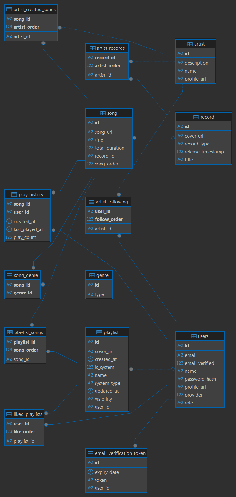

 # Cadence Backend

 Music streaming backend built with Spring Boot. It provides authentication, artist and record management, song streaming, playlists, discovery & search, and event-driven features powered by Kafka. Media storage integrates with AWS S3; persistence uses MySQL.

 ## Tech Stack
 - Java 17, Spring Boot 3
 - Spring Data JPA (MySQL)
 - Spring Security (JWT, OAuth2)
 - Apache Kafka (events and consumers)
 - AWS S3 SDK (media storage)
 - Jakarta Mail (email notifications)
 - Maven (build & dependency management)

 ---

 ## Quick Start

 ### Prerequisites
 - Java 17+
 - Maven 3.9+
 - MySQL 8+ (running and reachable)
 - Docker (for local Kafka and MySQL via Compose)
 - Optional: AWS account (S3), Google OAuth credentials, SMTP account

 ### 1) Clone

 ```bash
 git clone https://your-repo/cadence-backend.git
 cd cadence-backend
 ```

### 2) Create Database (skip if using Docker Compose)

 ```sql
 CREATE DATABASE cadence CHARACTER SET utf8mb4 COLLATE utf8mb4_unicode_ci;
 ```

 ### 3) Configure Environment

 The application loads additional properties from an env file declared in
 [`application.properties`](src/main/resources/application.properties):

 ```properties
 spring.config.import=optional:file:env.properties
 ```

 Create an `env.properties` at the project root (same directory as `pom.xml`) with values adjusted for your environment:

 ```properties
 # JWT
 JWT_SECRET_KEY=replace-with-strong-secret
 
 # MySQL
 DATASOURCE_URL=jdbc:mysql://localhost:3306/cadence?useSSL=false&serverTimezone=UTC
DATASOURCE_USERNAME=cadence      # matches docker compose defaults
DATASOURCE_PASSWORD=cadence      # matches docker compose defaults
 
 # App URLs
 FRONTEND_URL=http://localhost:5173
 BACKEND_URL=http://localhost:8080
 
 # AWS (optional for local dev)
 AWS_ACCESS_KEY=your_access_key
 AWS_SECRET_KEY=your_secret_key
 AWS_REGION=us-east-1
 AWS_S3_BUCKET=your-bucket-name
 
 # Google OAuth (optional)
 GOOGLE_CLIENT_ID=your_google_client_id
 GOOGLE_CLIENT_SECRET=your_google_client_secret
 
 # SMTP (email notifications)
 MAIL_USERNAME=your_smtp_username
 MAIL_PASSWORD=your_smtp_password
 
 # Kafka
 KAFKA_URL=localhost:9092
 ```

### 4) Start Kafka and MySQL (Local)

This repository includes:
- A single-broker Kafka setup using KRaft (no Zookeeper)
- A MySQL 8.3 database pre-configured with database `cadence`, user `cadence`, password `cadence`

From the project root:

 ```bash
 docker compose up -d
 ```

Services:
- Kafka broker at `localhost:9092` (data persisted in `kafka-data`)
- MySQL at `localhost:3306` (data persisted in `mysql-data`)

Ensure `KAFKA_URL` in `env.properties` matches `localhost:9092` (default). The default datasource values above match the compose defaults.

 ### 5) Run the App

 ```bash
 ./mvnw spring-boot:run
 ```

 The app starts on port `8080` by default.

 ---

 ## Usage

 ### Authentication

 - Register: `POST /auth/v1/register`
 - Authenticate: `POST /auth/v1/authenticate`
 - Validate Email: `POST /auth/v1/validateEmail`

 Example (register):

 ```bash
 curl -X POST http://localhost:8080/auth/v1/register \
   -H "Content-Type: application/json" \
   -d '{
         "name": "Alice",
         "email": "alice@example.com",
         "password": "StrongPassword1!"
       }'
 ```

 Example (authenticate):

 ```bash
 TOKEN=$(curl -s -X POST http://localhost:8080/auth/v1/authenticate \
   -H "Content-Type: application/json" \
   -d '{ "email": "alice@example.com", "password": "StrongPassword1!" }' \
   | jq -r '.data.accessToken')
 ```

 Use `Authorization: Bearer <token>` for protected endpoints.

 ### Stream a Song

 - Endpoint: `GET /api/v1/song/stream/{songId}`

 ```bash
 curl -L http://localhost:8080/api/v1/song/stream/{songId} \
   -H "Authorization: Bearer $TOKEN" \
   -o song.mp3
 ```

 ---

 ## API Overview

 Base paths group by feature. Most API responses wrap data using a consistent `ApiResponseDTO` envelope.

 - Authentication: `/auth/v1`
   - POST `/register`
   - POST `/authenticate`
   - POST `/validateEmail`

 - App: `/app/v1`
   - GET `/ping`
   - GET `/verify-email?token=<token>`

 - Artists: `/api/v1/artist`
   - POST `/upsert` (ADMIN)
   - DELETE `/delete/{artistId}` (ADMIN)
   - GET `/all?page=&size=&key=`
   - GET `/{artistId}`
   - POST `/{artistId}/follow`
   - POST `/{artistId}/unfollow`
   - GET `/{artistId}/isFollowing`
   - GET `/{artistId}/followers`

 - Records: `/api/v1/record`
   - POST `/upsert` (ADMIN)
   - DELETE `/delete/{recordId}` (ADMIN)
   - GET `/all?artistId=`
   - GET `/{recordId}`

 - Songs: `/api/v1/song`
   - GET `/all?recordId=`
   - GET `/{songId}`
   - GET `/stream/{songId}`

 - Playlists: `/api/v1/playlist`
   - GET `/all`
   - POST `/upsert`
   - PUT `/{playlistId}/song/{songId}`
   - DELETE `/{playlistId}/song/{songId}`
   - PUT `/{playlistId}/like`
   - GET `/{playlistId}`
   - GET `/{playlistId}/songs`
   - DELETE `/{playlistId}`

 - Genres: `/api/v1/genre`
   - POST `/add` (ADMIN)
   - GET `/all?page=&size=&key=`

 - Search & Discover: `/api/v1`
   - GET `/search?page=&size=&key=`
   - GET `/discover`

 See the controllers under
 [controller](src/main/java/com/project/cadence/controller)
 for request/response shapes and validations.

 ---

 ## Database Schema

 The schema is defined using JPA entities under
 [model](src/main/java/com/project/cadence/model).

 ### Core Entities and Relationships
 - User (`users`)
   - One-to-many with `Playlist` (owner)
   - Many-to-many following `Artist` (join table `artist_following`)
   - Many-to-many liked `Playlist` (join table `liked_playlists`)
   - One-to-many `PlayHistory`
 - Artist
   - Many-to-many with `Record` (join table `artist_records`)
   - Many-to-many with `Song` as creators (join table `artist_created_songs`)
   - Inverse many-to-many from `User` followers
 - Record
   - One-to-many `Song`
   - Many-to-many `Artist`
 - Song
   - Many-to-one `Record`
   - Many-to-many `Artist` (creators)
   - Many-to-many `Genre` (join table `song_genre`)
 - Playlist
   - Many-to-one `User` (owner)
   - Many-to-many `Song` (join table `playlist_songs`)
   - System playlists use deterministic IDs via `@PrePersist`
 - PlayHistory
   - Composite key of (`user_id`, `song_id`), tracks `playCount` and timestamps
 - Genre
   - Many-to-many with `Song`

 ### ER Diagram

 

 ---

 ## Eventing (Kafka)

 Topics are auto-created by Spring on startup (see `KafkaConfig`) and configured via `spring.kafka.*` properties.

 - Topics
   - `record_created`
   - `stream_song`
   - `user_created`

 - Producers
   - `RecordCreatedProducer` → `record_created`
   - `StreamSongProducer` → `stream_song`
   - `UserCreatedProducer` → `user_created`

 - Consumers
   - `RecordCreatedConsumer` — sends release email notifications
   - `StreamSongConsumer` — maintains `PlayHistory` per user/song
   - `UserCreatedListener` — creates a “Liked Songs” playlist per new user

 Ensure `KAFKA_URL` matches your running broker (e.g., `localhost:9092`). You can start Kafka locally using the included `compose.yaml`.

 ---

 ## Configuration Reference

 Key properties are defined in
 [`application.properties`](src/main/resources/application.properties).
 You must provide the values via `env.properties` or environment variables:

 - Database: `DATASOURCE_URL`, `DATASOURCE_USERNAME`, `DATASOURCE_PASSWORD`
 - JWT: `JWT_SECRET_KEY`
 - App URLs: `FRONTEND_URL`, `BACKEND_URL`
 - AWS: `AWS_ACCESS_KEY`, `AWS_SECRET_KEY`, `AWS_REGION`, `AWS_S3_BUCKET`
 - Google OAuth (optional): `GOOGLE_CLIENT_ID`, `GOOGLE_CLIENT_SECRET`
 - Mail: `MAIL_USERNAME`, `MAIL_PASSWORD`
 - Kafka: `KAFKA_URL`

 ---

 ## Troubleshooting

 - Cannot connect to Kafka
   - Verify Docker is running: `docker compose ps`
   - Confirm broker at `localhost:9092` and `KAFKA_URL` matches
 - Database errors
   - Check `DATASOURCE_*` values and that the `cadence` database exists
  - If using Docker Compose defaults: `DATASOURCE_USERNAME=cadence`, `DATASOURCE_PASSWORD=cadence`
 - S3 access issues
   - Ensure AWS credentials and region/bucket are valid, or disable S3 usage for local dev
 - Email delivery failures
   - Confirm SMTP credentials and provider settings (TLS/ports)

