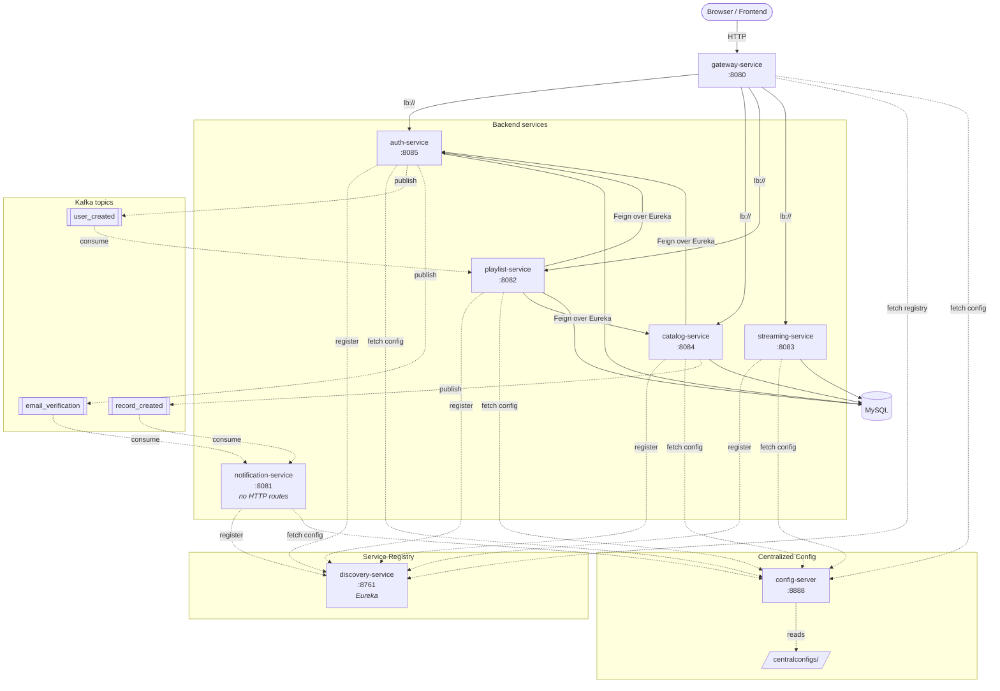
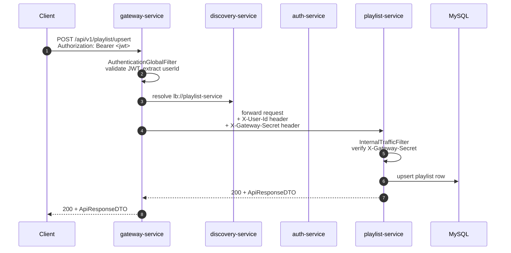
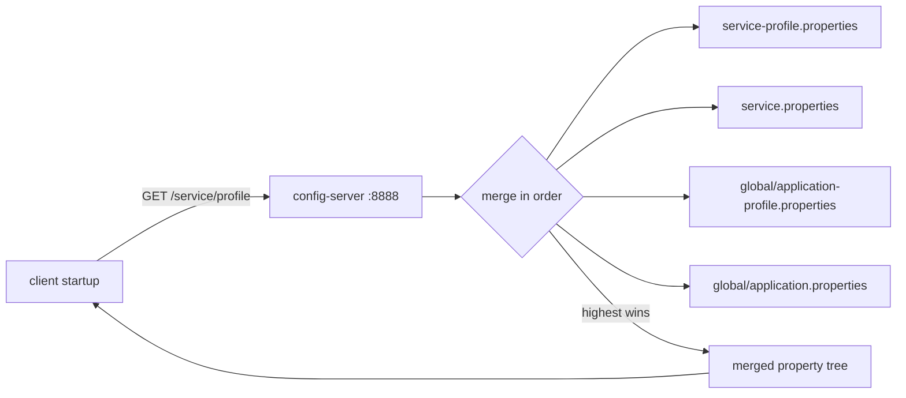
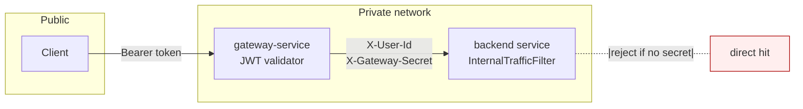

# Cadence

A music streaming backend split into a Spring Cloud microservices monorepo. Authentication, artist/record/song catalog, playlists, play-history analytics, and email notifications — wired together with a service registry, an API gateway, a centralized config server, and Kafka for asynchronous events.

The platform is built around the principle that **one service owns one bounded context, communicates synchronously through the gateway when it has to, and asynchronously through Kafka when it can**. Cross-service reads happen via Feign over Eureka; cross-service writes happen via events.

---

## Table of Contents

- [Getting Started](#getting-started)
- [Architecture](#architecture)
- [Request Flow](#request-flow)
- [Services](#services)
- [Centralized Configuration](#centralized-configuration)
- [Eventing (Kafka)](#eventing-kafka)
- [Inter-Service Authentication](#inter-service-authentication)
- [REST API](#rest-api)
- [Persistence Model](#persistence-model)
- [Repository Layout](#repository-layout)
- [Per-Environment Profiles](#per-environment-profiles)
- [Testing](#testing)
- [System Design Talking Points](#system-design-talking-points)
- [Troubleshooting](#troubleshooting)

---

## Getting Started

```bash
git clone https://github.com/<your-username>/cadence.git
cd cadence

# 1. Local infra (Kafka + MySQL)
docker compose up -d

# 2. Create env.properties at the repo root (see Centralized Configuration)

# 3. Boot services in order — separate terminals (each blocks)
(cd discovery-service    && ./mvnw spring-boot:run)
(cd config-server        && ./mvnw spring-boot:run)
(cd auth-service         && ./mvnw spring-boot:run)
(cd catalog-service      && ./mvnw spring-boot:run)
(cd playlist-service     && ./mvnw spring-boot:run)
(cd streaming-service    && ./mvnw spring-boot:run)
(cd notification-service && ./mvnw spring-boot:run)
(cd gateway-service      && ./mvnw spring-boot:run)
```

Useful local URLs:

| Surface | URL | Purpose |
|---|---|---|
| Gateway | `http://localhost:8080` | Public entry point — all client traffic goes here |
| Eureka dashboard | `http://localhost:8761` | See which services have registered |
| Config Server | `http://localhost:8888` | `GET /<service>/<profile>` to inspect served config |
| Kafka broker | `localhost:9092` | KRaft, single broker, no Zookeeper |
| MySQL | `localhost:3306` | DB `cadence`, user `cadence`, password `cadence` |

Run the full test suite (unit + integration via Testcontainers):

```bash
./run-all-tests.sh
```

Stop infra with `docker compose down`. Use `docker compose down -v` to wipe Kafka logs and MySQL data.

---

## Architecture

The gateway is the only public-facing process. Every backend service registers with Eureka, fetches its configuration from config-server at startup, and either serves HTTP requests (auth, catalog, playlist, streaming) or runs only as a Kafka consumer (notification).



Three things are worth calling out:

- **Eureka is required at boot** for the gateway and Feign clients to resolve `lb://<service>`. Bring it up first.
- **Config-server is required at boot** for services that lean on it for placeholders. The `optional:configserver:` import means a missing server won't crash startup, but values like `${DATASOURCE_URL}` will then be unresolved.
- **Kafka is the only async channel.** Feign is used for synchronous reads (e.g., catalog asking auth for a user preview); writes that fan out across services always go through Kafka.

---

## Request Flow

A client calling `POST /api/v1/playlist/upsert`:



Two filters bracket every request:

- **`AuthenticationGlobalFilter`** (gateway) — validates the JWT, derives `userId`, sets `X-User-Id` for downstream services.
- **`InternalTrafficFilter`** (each backend service) — rejects any request that doesn't carry `X-Gateway-Secret`, preventing direct hits to backend ports.

---

## Services

| Service | Port | Has HTTP | DB | Kafka | Purpose |
|---|---:|---|---|---|---|
| [discovery-service](discovery-service/) | 8761 | Eureka UI | — | — | Service registry. All other services register here. |
| [config-server](config-server/) | 8888 | Yes (config API) | — | — | Centralized configuration; serves files from `centralconfigs/`. |
| [gateway-service](gateway-service/) | 8080 | Yes | — | — | Public entry; routes by path prefix; validates JWT; injects auth headers. |
| [auth-service](auth-service/) | 8085 | Yes | `users`, `email_verification_token` | Producer | Registration, login, JWT issuance, OAuth2 (Google), email verification flow. |
| [catalog-service](catalog-service/) | 8084 | Yes | `artist`, `record`, `song`, `genre`, `artist_following` | Producer | Artists/records/songs/genres CRUD, S3 uploads, follow/unfollow. |
| [playlist-service](playlist-service/) | 8082 | Yes | `playlist`, `liked_playlists`, `playlist_songs` | Consumer | User playlists + system Liked-Songs playlist. |
| [streaming-service](streaming-service/) | 8083 | Yes | `play_history` | — | Play-history aggregation, trending songs, listener counts. |
| [notification-service](notification-service/) | 8081 | No (consumer-only) | — | Consumer | SMTP email sender driven by Kafka events. |

Each service has its own README with deeper architecture diagrams and API details — follow the links above.

---

## Centralized Configuration

Config-server serves YAML/properties from `config-server/centralconfigs/` over plain HTTP. Each backend service merges three layers at startup:

1. Its own minimal `application.properties` (just `spring.application.name`, `server.port`, and the `spring.config.import` line)
2. `centralconfigs/<service>/<service>.properties` — service-specific config
3. `centralconfigs/global/application.properties` — shared across all services

When `spring.profiles.active=<env>` is set, profile-specific files are merged on top:



`env.properties` at the repo root provides actual secret values that fill in the `${PLACEHOLDER}` references in the centralized files. It is **gitignored** — never commit it.

```properties
# env.properties (root) — gitignored

JWT_SECRET_KEY=replace-with-strong-secret-at-least-32-bytes
GATEWAY_SECRET=any-shared-secret

DATASOURCE_URL=jdbc:mysql://localhost:3306/cadence?useSSL=false&serverTimezone=UTC
DATASOURCE_USERNAME=cadence
DATASOURCE_PASSWORD=cadence

FRONTEND_URL=http://localhost:5173
BACKEND_URL=http://localhost:8080

AWS_ACCESS_KEY=...
AWS_SECRET_KEY=...
AWS_REGION=us-east-1
AWS_S3_BUCKET=...

GOOGLE_CLIENT_ID=...
GOOGLE_CLIENT_SECRET=...

MAIL_USERNAME=...
MAIL_PASSWORD=...

KAFKA_URL=localhost:9092
EUREKA_SERVER_URL=http://localhost:8761/eureka
```

See [config-server/README.md](config-server/README.md) for the full layout and how to add per-environment overrides.

---

## Eventing (Kafka)

Topics are auto-created by the producer on first send (`spring.kafka.admin.auto-create=true`). Single-broker KRaft setup; no Zookeeper.

| Topic | Producer | Consumers | Purpose |
|---|---|---|---|
| `user_created` | `auth-service.UserCreatedProducer` | `playlist-service.UserCreatedConsumer` | New user registered → playlist-service creates a Liked-Songs system playlist for them. |
| `email_verification` | `auth-service.EmailVerificationProducer` | `notification-service.EmailVerificationConsumer` | Sign-up triggers a verification email send. |
| `record_created` | `catalog-service.RecordCreatedProducer` | `notification-service.RecordCreatedConsumer` | New record uploaded → notification-service emails followers of all participating artists. |

Consumers use Spring Kafka's `@KafkaListener`. JSON deserialization with `JsonDeserializer` and `spring.json.trusted.packages=*` for cross-service event types.

---

## Inter-Service Authentication

The gateway is the only public-facing process. Backend services are protected by **two layers**:



- **JWT** issued by auth-service, validated by gateway's `AuthenticationGlobalFilter`. Extracted `userId` becomes `X-User-Id` for downstream services.
- **Gateway secret** (`GATEWAY_SECRET` env var, shared between gateway and backends) sent as `X-Gateway-Secret` on every forwarded request. Backend services have an `InternalTrafficFilter` that rejects requests missing this header — defense against direct port access if backend services are exposed by accident.

---

## REST API

All public routes are reachable through the gateway at `:8080`. Most responses wrap the payload in `ApiResponseDTO<T>`.

| Prefix | Service | Group |
|---|---|---|
| `/auth/v1` | auth-service | Registration, login, email validation |
| `/app/v1` | auth-service | Health probes, email verification token redemption |
| `/oauth2`, `/login` | auth-service | Google OAuth2 callback flow |
| `/api/v1/user`, `/api/v1/email` | auth-service | User profile, email change |
| `/api/v1/artist` | catalog-service | Artists + follow/unfollow |
| `/api/v1/record` | catalog-service | Records (albums/EPs/singles) |
| `/api/v1/song` | catalog-service | Songs |
| `/api/v1/genre` | catalog-service | Genres |
| `/api/v1/files` | catalog-service | S3 upload/download |
| `/api/v1/search`, `/api/v1/discover` | catalog-service | Search + discovery |
| `/api/v1/playlist` | playlist-service | Playlists, liking, song add/remove |
| `/api/v1/stream` | streaming-service | Streaming + play-history stats |

Endpoint-level detail lives in each service's README.

---

## Persistence Model

Each service owns its tables. A few cross-service reads happen by table name (notably catalog-service reading `users` and `artist_following`); see each service README for ownership boundaries.


---

## Repository Layout

```text
cadence/
├── config-server/
│   └── centralconfigs/         # served by config-server (file backend)
│       ├── global/             # applies to every client
│       │   ├── application.properties
│       │   └── application-{dev,qa,prod}.properties
│       └── <service>/<service>.properties
├── discovery-service/          # Eureka server
├── gateway-service/            # Spring Cloud Gateway
├── auth-service/
├── catalog-service/
├── playlist-service/
├── streaming-service/
├── notification-service/
├── cadence-frontend/           # React/Vite client (separate workspace)
├── compose.yaml                # local Kafka + MySQL via Docker Compose
├── env.properties              # local secrets — gitignored
├── run-all-tests.sh            # runs unit + IT across every service
├── TESTING.md                  # test layout, IT setup, Docker workarounds
└── README.md                   # this file
```

---

## Per-Environment Profiles

`config-server/centralconfigs/global/` ships with overrides for `dev`, `qa`, and `prod`:

| Profile | `ddl-auto` | SQL logging | Error details | Log level |
|---|---|---|---|---|
| (none) | `update` | off | message-only | INFO |
| `dev` | `update` | on | message + stacktrace on `?trace=true` | DEBUG |
| `qa` | `validate` | off | message-only | INFO |
| `prod` | `validate` | off | none (no leakage) | WARN |

Activate with `SPRING_PROFILES_ACTIVE=dev`. Per-service profile files (`<service>-<profile>.properties`) live alongside the base file in `centralconfigs/<service>/`.

---

## Testing

| Layer | Style | Coverage |
|---|---|---|
| Unit | Plain JUnit 5 + Mockito | Services, filters, utilities |
| Controller slice | `@WebMvcTest` with `@MockBean` services | HTTP wiring, validation, error mapping |
| Integration | `@SpringBootTest` with Testcontainers (MySQL + Kafka where relevant) | Real JPA queries, real Kafka publish/consume, transactional behavior |

```bash
# Run everything across all services
./run-all-tests.sh

# Or per service
cd auth-service && ./mvnw test
```

See [TESTING.md](TESTING.md) for the test layout, the Docker Desktop on Windows workaround, and the singleton-container pattern that lets multiple test classes share one MySQL/Kafka container per JVM.

---

## System Design Talking Points

- **Gateway is the only public surface.** Backend services bind to internal ports and reject anything missing `X-Gateway-Secret`. Zero trust between gateway and the world; trusted-zone shortcuts inside.
- **JWT validated once, identity propagated as a header.** Backend services don't re-validate the JWT or talk to auth-service per request — they trust `X-User-Id` because it can only have come through the gateway.
- **Eureka resolves `lb://<service>`.** Gateway routes and Feign clients both use service names rather than hostnames, so scaling, failover, and local-vs-prod hostname swaps just work.
- **Config-server serves placeholder text, not values.** Secrets live in env vars or local `env.properties`; the config-server only knows the *shape* of the config. Rotating a secret doesn't require touching the repo.
- **`spring.config.import=optional:`** for both env file and config server. A service starts even if either is missing — tests in particular rely on this so they don't need the whole stack running.
- **Each service owns its tables.** Cross-service reads via Feign (synchronous) or Kafka events (async). The two cross-service `JdbcTemplate` queries in catalog-service (`users`, `artist_following`) are explicit pragmatic shortcuts and are documented in catalog-service's README.
- **Kafka is the async fan-out.** Producers and consumers don't share a request lifecycle; a registration completing successfully doesn't block on the email actually being sent. Consumer crashes/lag don't break user-facing flows.
- **Topics auto-created by producers.** `spring.kafka.admin.auto-create=true` plus `NewTopic` beans give a deterministic schema (3 partitions, 1 replica) without provisioning scripts.
- **Containers reused across test classes.** `BaseIntegrationTest` starts MySQL/Kafka in a `static {}` block instead of `@Container`, so multiple ITs in one JVM share one container — saves ~10s startup per test class.

---

## Troubleshooting

- **`Connection refused` from a service to Eureka** — discovery-service isn't up yet, or `EUREKA_SERVER_URL` doesn't match. Check <http://localhost:8761>.
- **Service starts but config values are placeholders** — config-server is unreachable. Hit `http://localhost:8888/<service>/default` to verify it's serving. Check `spring.config.import` in the service's `application.properties`.
- **`No qualifying bean of type 'ClientRegistrationRepository'`** — `auth-service` requires `GOOGLE_CLIENT_ID` / `GOOGLE_CLIENT_SECRET` in `env.properties`.
- **Gateway returns 503 for a service** — that service hasn't registered with Eureka yet, or it crashed at startup. Check Eureka dashboard.
- **Kafka `Connection refused`** — `docker compose up -d` not run, or `KAFKA_URL` mismatch.
- **`Could not find a valid Docker environment` during tests** — see TESTING.md for the Docker Desktop on Windows workaround.
