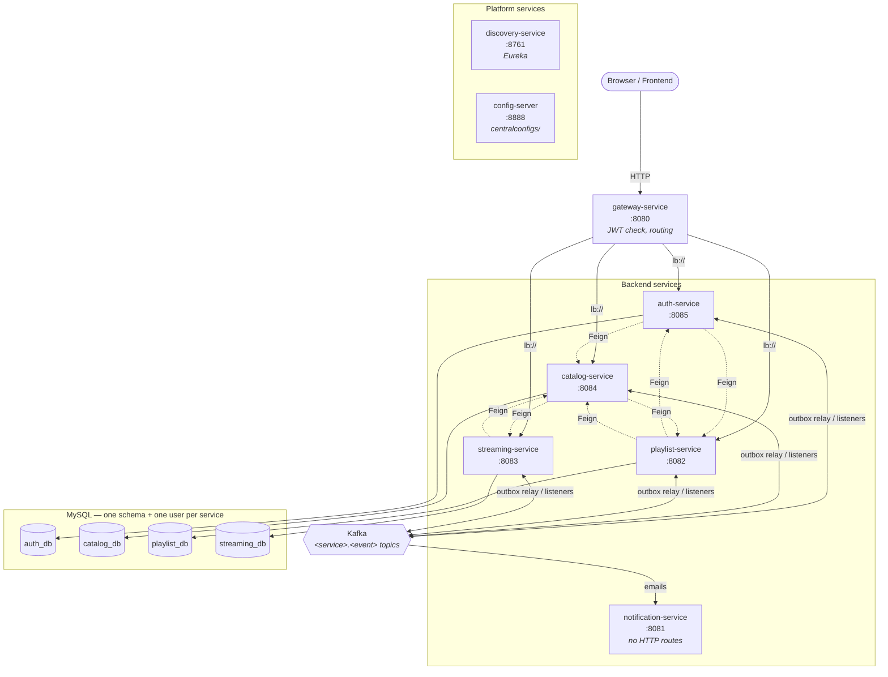
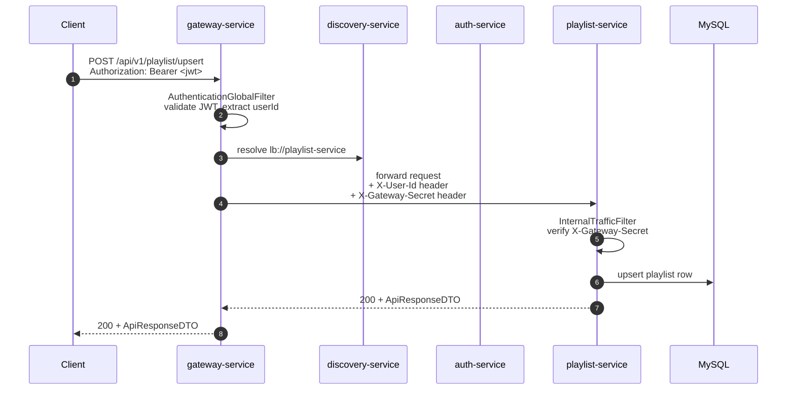
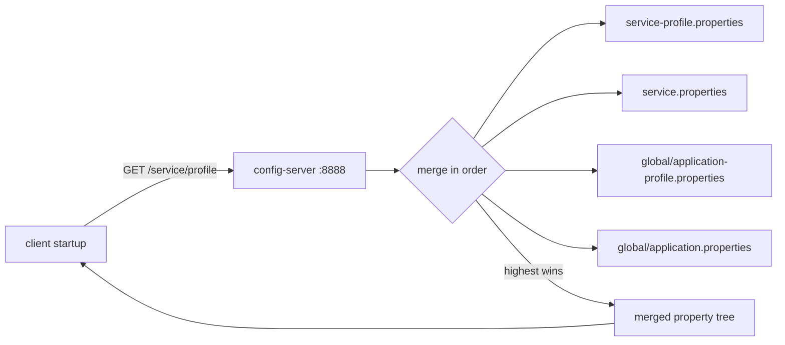
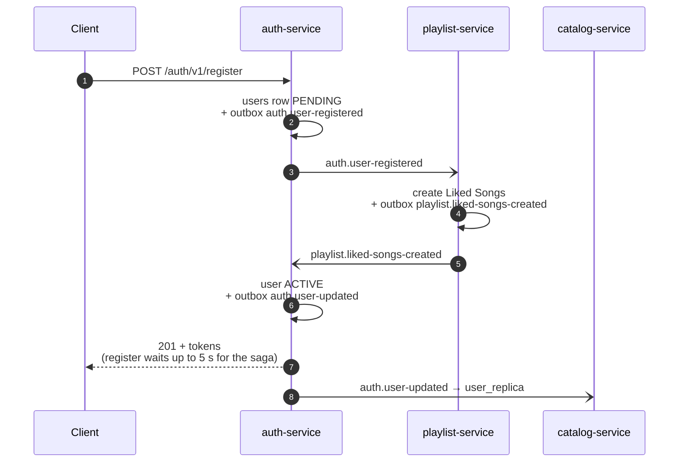
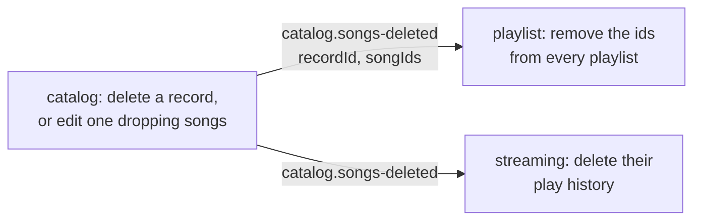
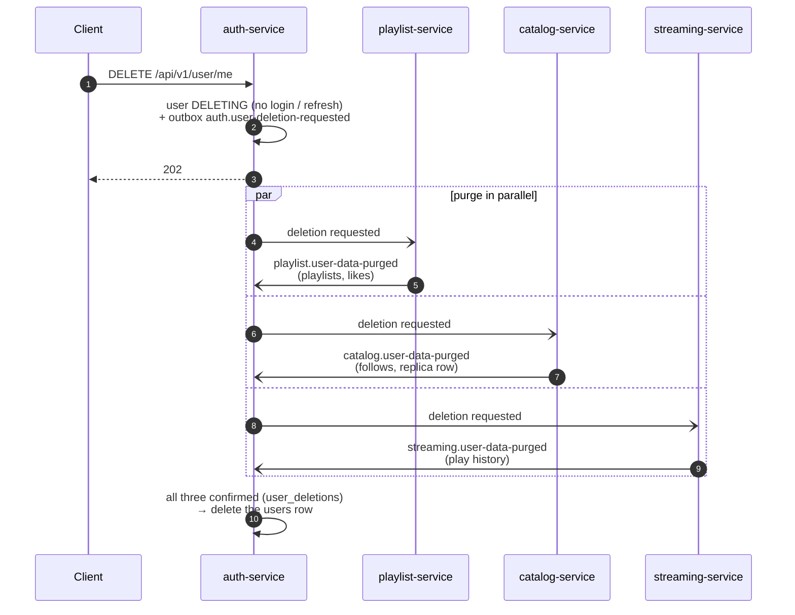
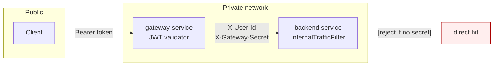
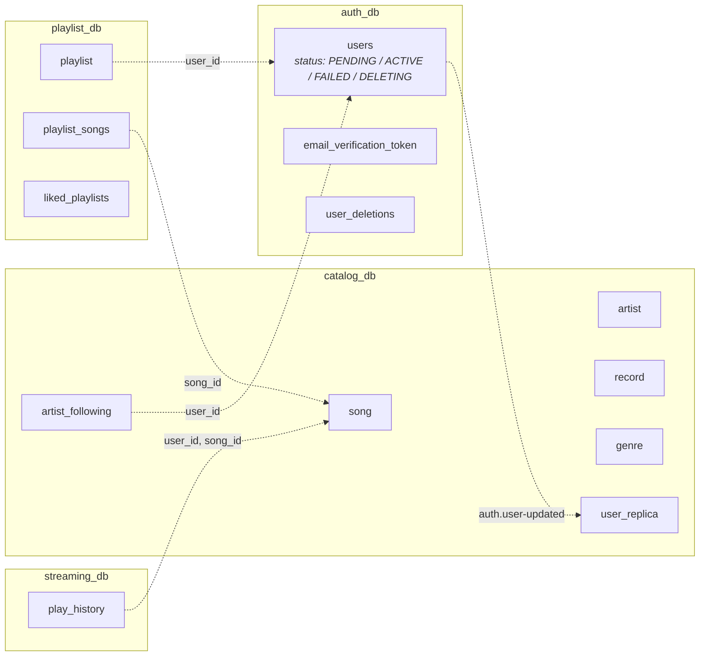
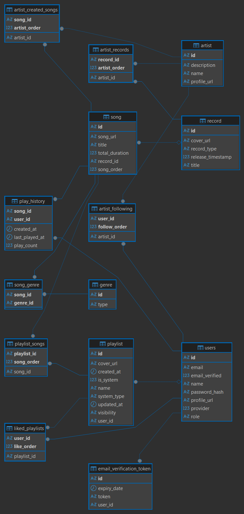

# Cadence

A music streaming backend split into a Spring Cloud microservices monorepo. Authentication, artist/record/song catalog, playlists, play-history analytics, and email notifications — wired together with a service registry, an API gateway, a centralized config server, and Kafka for asynchronous events.

The platform is built around the principle that **one service owns one bounded context, communicates synchronously through the gateway when it has to, and asynchronously through Kafka when it can**. Each service has its **own database schema** that no other service can touch; cross-service reads happen via Feign over Eureka or event-fed replicas, and cross-service writes happen via events. Workflows that span services — registration, song deletion, account deletion — run as **choreographed sagas** over Kafka, with a transactional outbox so an event is published if and only if its database change commits.

---

## Table of Contents

- [Getting Started](#getting-started)
- [Architecture](#architecture)
- [Request Flow](#request-flow)
- [Services](#services)
- [Centralized Configuration](#centralized-configuration)
- [Eventing (Kafka)](#eventing-kafka)
- [Data Ownership & Sagas](#data-ownership--sagas)
- [Inter-Service Authentication](#inter-service-authentication)
- [REST API](#rest-api)
- [Persistence Model](#persistence-model)
- [Repository Layout](#repository-layout)
- [Per-Environment Profiles](#per-environment-profiles)
- [Testing](#testing)
- [Performance](#performance)
- [System Design Talking Points](#system-design-talking-points)
- [Troubleshooting](#troubleshooting)

---

## Getting Started

The whole stack is dockerised — one command brings up MySQL, Kafka, all 8 backend services, and the frontend.

```bash
git clone https://github.com/harshithrao07/cadence.git
cd cadence

# 1. Create env.properties at the repo root (see Centralized Configuration)

# 2. Build and start everything
docker compose up --build -d

# 3. (Optional) Seed the database with realistic fake data
cd cadence-seed
npm install
node seed.js
```

The compose file orchestrates **boot order via healthchecks**: MySQL + Kafka come up first, then discovery-service + config-server, then the backend services, then the gateway, then the frontend. Total cold-start is ~2-3 minutes (most of it is Maven downloads on first build; subsequent `up` calls take ~30s).

Useful local URLs:

| Surface | URL | Purpose |
|---|---|---|
| **Frontend** | `http://localhost:3000` | The user-facing Next.js app |
| Gateway | `http://localhost:8080` | API entry point — all client traffic goes here |
| Eureka dashboard | `http://localhost:8761` | See which services have registered |
| Config Server | `http://localhost:8888` | `GET /<service>/<profile>` to inspect served config |
| Kafka broker | `localhost:9092` | KRaft, single broker, no Zookeeper |
| MySQL | `localhost:3306` | One schema per service (`auth_db`, `catalog_db`, `playlist_db`, `streaming_db`), each with its own user (`auth_svc`, …; dev passwords in `compose.yaml`). Admin: `root` / `password` |

### Running locally without Docker

For active development on a single service (faster reload, easier debugging), you can run that one service from your IDE / `./mvnw spring-boot:run` while leaving the rest of the stack in Docker. Stop the container of the service you want to run locally:

```bash
docker compose stop auth-service
./mvnw -pl cadence-messaging -am install -DskipTests   # once, and again after changing cadence-events / cadence-messaging
(cd auth-service && ./mvnw spring-boot:run)            # uses env.properties for secrets
```

A locally run service needs its own schema and user in `env.properties` (e.g. for auth-service
`DATASOURCE_URL=jdbc:mysql://localhost:3306/auth_db?...`, `DATASOURCE_USERNAME=auth_svc`,
`DATASOURCE_PASSWORD=auth_dev_password`); in Docker, compose sets these per service.

Your local instance registers with the dockerized Eureka and fetches config from the dockerized config-server.

### Running tests

```bash
./run-all-tests.sh
```

Tests use Testcontainers — they spin up their own MySQL + Kafka containers, independent of the docker compose stack. See [TESTING.md](TESTING.md).

### Stopping

```bash
docker compose down            # stop containers, keep data
docker compose down -v         # stop + wipe MySQL and Kafka volumes
```

---

## Architecture

The gateway is the only public-facing process. Every backend service registers with Eureka, fetches its configuration from config-server at startup, and either serves HTTP requests (auth, catalog, playlist, streaming) or runs only as a Kafka consumer (notification). Each service with state owns one MySQL schema, reachable only with that service's database user.


```mermaid
flowchart TB
    client([Browser / Frontend])
    client -->|HTTP| gateway[gateway-service<br/>:8080<br/><i>JWT check, routing</i>]

    subgraph PLATFORM[Platform services]
        eureka[discovery-service<br/>:8761<br/><i>Eureka</i>]
        cfgsrv[config-server<br/>:8888<br/><i>centralconfigs/</i>]
    end

    subgraph BE[Backend services]
        auth[auth-service<br/>:8085]
        catalog[catalog-service<br/>:8084]
        playlist[playlist-service<br/>:8082]
        streaming[streaming-service<br/>:8083]
        notif[notification-service<br/>:8081<br/><i>no HTTP routes</i>]
    end

    gateway -->|lb://| auth & catalog & playlist & streaming

    subgraph MYSQL[MySQL — one schema + one user per service]
        authdb[(auth_db)]
        catdb[(catalog_db)]
        pldb[(playlist_db)]
        stdb[(streaming_db)]
    end

    auth --> authdb
    catalog --> catdb
    playlist --> pldb
    streaming --> stdb

    kafka{{Kafka<br/><i>&lt;service&gt;.&lt;event&gt; topics</i>}}
    auth & catalog & playlist & streaming <-->|outbox relay / listeners| kafka
    kafka -->|emails| notif

    auth -.->|Feign| catalog & playlist
    catalog -.->|Feign| playlist & streaming
    playlist -.->|Feign| auth & catalog
    streaming -.->|Feign| catalog

```

Solid arrows are requests and data ownership; dotted arrows are synchronous Feign reads. Every service also registers with Eureka and pulls its config from config-server (omitted for readability).

Things worth calling out:

- **No shared database.** Each service connects as its own MySQL user (`auth_svc`, `catalog_svc`, …) granted only its own schema, so a cross-service query fails with a permission error. Data owned elsewhere arrives through Feign (read-time) or through an event-fed replica (catalog's `user_replica`). See [Data Ownership & Sagas](#data-ownership--sagas).
- **Kafka carries every cross-service write.** Events go through a transactional outbox in the producer's schema and a relay, so they're published exactly when the business change commits. Feign is only used for synchronous reads — e.g. auth asking catalog for a user's followed artists, playlist asking catalog for song previews, catalog asking playlist who owns a playlist.
- **Eureka is required at boot** for the gateway and Feign clients to resolve `lb://<service>`. Bring it up first.
- **Config-server is required at boot** for services that lean on it for placeholders. The `optional:configserver:` import means a missing server won't crash startup, but values like `${DATASOURCE_URL}` will then be unresolved.

---

## Request Flow

A client calling `POST /api/v1/playlist/upsert`:


```mermaid
sequenceDiagram
    autonumber
    participant Client
    participant Gateway as gateway-service
    participant Eureka as discovery-service
    participant Auth as auth-service
    participant Playlist as playlist-service
    participant DB as MySQL

    Client->>Gateway: POST /api/v1/playlist/upsert<br/>Authorization: Bearer <jwt>
    Gateway->>Gateway: AuthenticationGlobalFilter<br/>validate JWT, extract userId
    Gateway->>Eureka: resolve lb://playlist-service
    Gateway->>Playlist: forward request<br/>+ X-User-Id header<br/>+ X-Gateway-Secret header
    Playlist->>Playlist: InternalTrafficFilter<br/>verify X-Gateway-Secret
    Playlist->>DB: upsert playlist row
    Playlist-->>Gateway: 200 + ApiResponseDTO
    Gateway-->>Client: 200 + ApiResponseDTO
```

Two filters bracket every request:

- **`AuthenticationGlobalFilter`** (gateway) — validates the JWT, derives `userId`, sets `X-User-Id` for downstream services.
- **`InternalTrafficFilter`** (each backend service) — rejects any request that doesn't carry `X-Gateway-Secret`, preventing direct hits to backend ports.

---

## Services

| Service | Port | Has HTTP | Schema / tables | Kafka | Purpose |
|---|---:|---|---|---|---|
| [discovery-service](discovery-service/) | 8761 | Eureka UI | — | — | Service registry. All other services register here. |
| [config-server](config-server/) | 8888 | Yes (config API) | — | — | Centralized configuration; serves files from `centralconfigs/`. |
| [gateway-service](gateway-service/) | 8080 | Yes | — | — | Public entry; routes by path prefix; validates JWT; injects auth headers. |
| [auth-service](auth-service/) | 8085 | Yes | `auth_db`: `users`, `email_verification_token`, `user_deletions` | Producer + consumer | Registration, login, JWT issuance, OAuth2 (Google), email verification. Coordinates the registration and account-deletion sagas. |
| [catalog-service](catalog-service/) | 8084 | Yes | `catalog_db`: `artist`, `record`, `song`, `genre`, join tables, `artist_following`, `user_replica` | Producer + consumer | Artists/records/songs/genres CRUD, S3 uploads, follow/unfollow, discovery. |
| [playlist-service](playlist-service/) | 8082 | Yes | `playlist_db`: `playlist`, `playlist_songs`, `liked_playlists` | Producer + consumer | User playlists + the system Liked Songs playlist (registration saga participant). |
| [streaming-service](streaming-service/) | 8083 | Yes | `streaming_db`: `play_history` | Producer + consumer | Play-history aggregation, trending songs, listener counts. |
| [notification-service](notification-service/) | 8081 | No (consumer-only) | — | Consumer | SMTP email sender driven by Kafka events. |

Every schema also has an `outbox` table (events waiting to be relayed) and a `processed_events` table (events this
service has already handled), both provided by [cadence-messaging](cadence-messaging/).

Each service has its own README with deeper architecture diagrams and API details — follow the links above.

---

## Centralized Configuration

Config-server serves YAML/properties from `config-server/centralconfigs/` over plain HTTP. Each backend service merges three layers at startup:

1. Its own minimal `application.properties` (just `spring.application.name`, `server.port`, and the `spring.config.import` line)
2. `centralconfigs/<service>/<service>.properties` — service-specific config
3. `centralconfigs/global/application.properties` — shared across all services

When `spring.profiles.active=<env>` is set, profile-specific files are merged on top:


```mermaid
flowchart LR
    A[client startup] -->|GET /service/profile| B[config-server :8888]
    B --> C{merge in order}
    C --> S1[service-profile.properties]
    C --> S2[service.properties]
    C --> G1[global/application-profile.properties]
    C --> G2[global/application.properties]
    C -->|highest wins| D[merged property tree]
    D --> A
```

`env.properties` at the repo root provides actual secret values that fill in the `${PLACEHOLDER}` references in the centralized files. It is **gitignored** — never commit it.

```properties
# env.properties (root) — gitignored

JWT_SECRET_KEY=replace-with-strong-secret-at-least-32-bytes
GATEWAY_SECRET=any-shared-secret

# Only used when running a service outside Docker — point it at that service's schema/user
# (compose overrides these per container).
DATASOURCE_URL=jdbc:mysql://localhost:3306/auth_db?useSSL=false&serverTimezone=UTC&allowPublicKeyRetrieval=true
DATASOURCE_USERNAME=auth_svc
DATASOURCE_PASSWORD=auth_dev_password

FRONTEND_URL=http://localhost:5173
BACKEND_URL=http://localhost:8080

AWS_ACCESS_KEY=...
AWS_SECRET_KEY=...
AWS_REGION=us-east-1
AWS_S3_BUCKET=...

GOOGLE_CLIENT_ID=...
GOOGLE_CLIENT_SECRET=...

MAIL_USERNAME=...
MAIL_PASSWORD=...

KAFKA_URL=localhost:9092
EUREKA_SERVER_URL=http://localhost:8761/eureka
```

See [config-server/README.md](config-server/README.md) for the full layout and how to add per-environment overrides.

---

## Eventing (Kafka)

Each producing service declares its topics as `NewTopic` beans (3 partitions), created at startup by `KafkaAdmin`. Single-broker KRaft setup; no Zookeeper.

| Topic | Producer | Consumers | Purpose |
|---|---|---|---|
| `auth.user-registered` | `auth-service.UserRegisteredProducer` | `playlist-service.UserRegisteredConsumer` | Registration saga start: playlist-service creates the user's Liked Songs playlist and replies. |
| `playlist.liked-songs-created` / `playlist.liked-songs-failed` | `playlist-service.UserRegisteredConsumer` | `auth-service.LikedSongsReplyConsumer` | Registration saga reply: auth activates the user, or marks the registration FAILED (compensation). |
| `auth.email-verification` | `auth-service.EmailVerificationProducer` | `notification-service.EmailVerificationConsumer` | Sign-up triggers a verification email send. |
| `catalog.record-created` | `catalog-service.RecordCreatedProducer` | `notification-service.RecordCreatedConsumer` | New record uploaded → notification-service emails followers of all participating artists. |
| `auth.user-updated` | `auth-service.UserUpdatedProducer` | `catalog-service.UserUpdatedConsumer` | User created or profile changed → catalog upserts its `user_replica`. |
| `catalog.songs-deleted` | `catalog-service.SongsDeletedProducer` | `playlist-service.SongsDeletedConsumer`, `streaming-service.SongsDeletedConsumer` | Record deleted, or songs dropped from a record → playlists and play history forget those song ids. |
| `auth.user-deletion-requested` | `auth-service.UserDeletionRequestedProducer` | `playlist-service`, `catalog-service`, `streaming-service` `UserDeletionRequestedConsumer` | Account deletion saga: each service purges the user's data and replies `<service>.user-data-purged`; auth deletes the user once all three have. |
| `playlist.user-data-purged` / `catalog.user-data-purged` / `streaming.user-data-purged` | each participant's `UserDeletionRequestedConsumer` | `auth-service.UserDataPurgedConsumer` | Account deletion saga confirmations. |
| `catalog.media-updated` | `catalog-service.MediaTargetWriter` | `auth-service.MediaUpdatedConsumer`, `playlist-service.MediaUpdatedConsumer` | Avatar / playlist cover stored or removed → the owning service updates its row after re-checking ownership. |

Event classes and topic names live in [cadence-events](cadence-events/); topics are named `<producing-service>.<event>`.
Delivery is handled by the shared [cadence-messaging](cadence-messaging/) auto-configuration:

- **Transactional outbox.** Producers write the event to an `outbox` table in the same transaction as the business change (`OutboxPublisher`); a polling relay (500 ms, `FOR UPDATE SKIP LOCKED`) sends it to Kafka. An event is published if and only if its transaction commits; delivery is at-least-once.
- **Envelope.** Every message value is `EventEnvelope` JSON (`eventId`, `sagaId`, `type`, `version`, `occurredAt`, `payload`) sent as a plain string.
- **Idempotent consumers.** `IdempotentEventHandler` records `(handler, eventId)` in `processed_events` in the consumer's transaction, so redeliveries are skipped. notification-service has no database and may send a duplicate email on redelivery.
- **Retries + DLT.** 4 exponential retries (1 s → 10 s), then the record goes to `<topic>.DLT`; malformed messages skip the retries.
- **Saga tracing.** Log lines carry `[saga:<id>]`; events published while handling an event keep its `sagaId`.

See [docs/db-per-service-saga-plan.md](docs/db-per-service-saga-plan.md) for the database-per-service migration this is part of.

---

## Data Ownership & Sagas

Every table belongs to exactly one service. When a service needs data it doesn't own, it uses one of three tools:

| Need | Tool | Example |
|---|---|---|
| Read someone else's data at request time | **Feign** call to the owner (internal endpoint, circuit breaker + fallback) | auth's profile page asks catalog for followed artists |
| Read it often, or join against it | **Event-fed replica**, kept in sync from the owner's events | catalog's `user_replica` (names, emails, avatars) from `auth.user-updated` |
| Change data in several services | **Saga** — a chain of local transactions linked by events | registration, song deletion, account deletion |

Ids that point into another service (`playlist.user_id`, `playlist_songs.song_id`, `play_history.user_id` /
`song_id`, `artist_following.user_id`) are plain columns without foreign keys; the sagas below keep them tidy, and
readers skip ids the owner no longer has.

The sagas are **choreographed**: no orchestrator; each participant reacts to the previous step's event, does its
work in a local transaction, and publishes the next event from the same transaction (outbox). Every event carries a
`sagaId`, so one saga can be followed across all services' logs (`[saga:<id>]`).

### Registration


```mermaid
sequenceDiagram
    autonumber
    participant C as Client
    participant A as auth-service
    participant P as playlist-service
    participant Cat as catalog-service

    C->>A: POST /auth/v1/register
    A->>A: users row PENDING<br/>+ outbox auth.user-registered
    A-)P: auth.user-registered
    P->>P: create Liked Songs<br/>+ outbox playlist.liked-songs-created
    P-)A: playlist.liked-songs-created
    A->>A: user ACTIVE<br/>+ outbox auth.user-updated
    A-->>C: 201 + tokens<br/>(register waits up to 5 s for the saga)
    A-)Cat: auth.user-updated → user_replica
```

- Only `ACTIVE` users get tokens; login, token refresh and Google sign-in are refused while `PENDING`.
- If the saga isn't done within 5 s, register answers **202** (no tokens) and the user can log in once it finishes.
- **Compensation:** an invalid request gets `playlist.liked-songs-failed` → the user becomes `FAILED`; a sweeper
  fails registrations with no reply after 5 minutes (e.g. a dead-lettered request). A `FAILED` user can register
  again with the same email; a late success still activates.

### Song deletion


```mermaid
flowchart LR
    del[catalog: delete a record,<br/>or edit one dropping songs] -->|catalog.songs-deleted<br/>recordId, songIds| pl[playlist: remove the ids<br/>from every playlist]
    del -->|catalog.songs-deleted| st[streaming: delete their<br/>play history]
```

Forward-only (nothing to undo): consumers are idempotent and retry, then dead-letter. Reads already skip songs catalog
no longer has, so leftover ids are invisible until purged (~1 s). The record's S3 files are deleted after the delete
commits.

### Account deletion


```mermaid
sequenceDiagram
    autonumber
    participant C as Client
    participant A as auth-service
    participant P as playlist-service
    participant Cat as catalog-service
    participant S as streaming-service

    C->>A: DELETE /api/v1/user/me
    A->>A: user DELETING (no login / refresh)<br/>+ outbox auth.user-deletion-requested
    A-->>C: 202
    par purge in parallel
        A-)P: deletion requested
        P-)A: playlist.user-data-purged<br/>(playlists, likes)
    and
        A-)Cat: deletion requested
        Cat-)A: catalog.user-data-purged<br/>(follows, replica row)
    and
        A-)S: deletion requested
        S-)A: streaming.user-data-purged<br/>(play history)
    end
    A->>A: all three confirmed (user_deletions)<br/>→ delete the users row
```

Forward-only: a sweeper re-sends the request for deletions still incomplete after 10 minutes, and every participant
is idempotent. The email can be used to register again once the row is gone.

### Known gaps

- Access tokens are stateless JWTs; after an account deletion, a still-valid access token (≤ 15 min) can still reach
  catalog / playlist / streaming.
- S3 files of deleted accounts, and audio of songs dropped from a record, are not removed.
- notification-service has no database, so a redelivered event can send a duplicate email.

---

## Inter-Service Authentication

The gateway is the only public-facing process. Backend services are protected by **two layers**:


```mermaid
flowchart LR
    subgraph public[Public]
        c[Client]
    end
    subgraph private[Private network]
        gw[gateway-service<br/>JWT validator]
        be[backend service<br/>InternalTrafficFilter]
    end
    c -->|Bearer token| gw
    gw -->|X-User-Id<br/>X-Gateway-Secret| be
    be -.|reject if no secret|.- x[direct hit]:::dropped

    classDef dropped fill:#fee,stroke:#a00
```

- **JWT** issued by auth-service, validated by gateway's `AuthenticationGlobalFilter`. Extracted `userId` becomes `X-User-Id` for downstream services.
- **Gateway secret** (`GATEWAY_SECRET` env var, shared between gateway and backends) sent as `X-Gateway-Secret` on every forwarded request — including public paths like `/oauth2/**` where no JWT is involved. Backend services have an `InternalTrafficFilter` that rejects requests missing this header — defense against direct port access if backend services are exposed by accident.
- **Feign clients also stamp `X-Gateway-Secret`** via a `RequestInterceptor` (`FeignClientConfig` in each Feign-using service), since service-to-service Feign calls pass through the same `InternalTrafficFilter` as gateway-forwarded requests.

---

## REST API

All public routes are reachable through the gateway at `:8080`. Most responses wrap the payload in `ApiResponseDTO<T>`.

| Prefix | Service | Group |
|---|---|---|
| `/auth/v1` | auth-service | Registration, login, email validation |
| `/app/v1` | auth-service | Health probes, email verification token redemption |
| `/oauth2`, `/login` | auth-service | Google OAuth2 callback flow |
| `/api/v1/user`, `/api/v1/email` | auth-service | User profile, email change |
| `/api/v1/artist` | catalog-service | Artists + follow/unfollow |
| `/api/v1/record` | catalog-service | Records (albums/EPs/singles) |
| `/api/v1/song` | catalog-service | Songs |
| `/api/v1/genre` | catalog-service | Genres |
| `/api/v1/files` | catalog-service | S3 upload/download |
| `/api/v1/search`, `/api/v1/discover` | catalog-service | Search + discovery |
| `/api/v1/playlist` | playlist-service | Playlists, liking, song add/remove |
| `/api/v1/stream` | streaming-service | Streaming + play-history stats |

Endpoint-level detail lives in each service's README.

---

## Persistence Model

**Database per service.** One MySQL server, one schema per service, and one MySQL user per service that is granted
only its own schema, so cross-service SQL fails with a permission error:

| Service | Schema | User |
|---|---|---|
| auth-service | `auth_db` | `auth_svc` |
| catalog-service | `catalog_db` | `catalog_svc` |
| playlist-service | `playlist_db` | `playlist_svc` |
| streaming-service | `streaming_db` | `streaming_svc` |

`docker/mysql/init/01-service-schemas.sh` creates them on the first start of an empty MySQL volume. For an existing
volume, run it once: `docker compose exec mysql sh /docker-entrypoint-initdb.d/01-service-schemas.sh` (from Git Bash
on Windows, prefix `MSYS_NO_PATHCONV=1`). Data owned by another service comes from Feign calls or event-fed replicas
(catalog's `user_replica`). Moving a service to its own MySQL server is a config change (its `DATASOURCE_*`).


```mermaid
flowchart LR
    subgraph auth_db
        users[users<br/><i>status: PENDING / ACTIVE / FAILED / DELETING</i>]
        evt[email_verification_token]
        ud[user_deletions]
    end
    subgraph catalog_db
        artist[artist]
        record[record]
        song[song]
        genre[genre]
        follow[artist_following]
        replica[user_replica]
    end
    subgraph playlist_db
        playlist[playlist]
        ps[playlist_songs]
        lp[liked_playlists]
    end
    subgraph streaming_db
        ph[play_history]
    end

    users -.->|auth.user-updated| replica
    follow -.->|user_id| users
    playlist -.->|user_id| users
    ps -.->|song_id| song
    ph -.->|user_id, song_id| song
```

Dotted lines are references by id only (no foreign key across schemas), kept consistent by events and sagas. Every
schema also holds its service's `outbox` and `processed_events`.

Column-level detail (diagram from before the split; the tables are unchanged apart from the additions above):



---

## Repository Layout

```text
cadence/
├── config-server/
│   └── centralconfigs/         # served by config-server (file backend)
│       ├── global/             # applies to every client
│       │   ├── application.properties
│       │   └── application-{dev,qa,prod}.properties
│       └── <service>/<service>.properties
├── discovery-service/          # Eureka server
├── gateway-service/            # Spring Cloud Gateway
├── auth-service/
├── catalog-service/
├── playlist-service/
├── streaming-service/
├── notification-service/
├── cadence-events/             # shared Kafka event records + topic names
├── cadence-messaging/          # auto-config: transactional outbox + relay, idempotent consumers, DLT, saga ids
├── cadence-frontend/           # Next.js client (separate workspace)
├── cadence-seed/               # bulk-loads fake data into all four schemas
├── docker/mysql/init/          # creates the per-service schemas and MySQL users
├── docs/                       # design notes (db-per-service + saga plan)
├── pom.xml                     # build aggregator (not a parent) — builds the shared modules before the services
├── compose.yaml                # the whole stack: MySQL, Kafka, services, frontend
├── env.properties              # local secrets — gitignored
├── run-all-tests.sh            # runs unit + IT across every service
├── TESTING.md                  # test layout, IT setup, Docker workarounds
└── README.md                   # this file
```

---

## Per-Environment Profiles

`config-server/centralconfigs/global/` ships with overrides for `dev`, `qa`, and `prod`:

| Profile | `ddl-auto` | SQL logging | Error details | Log level |
|---|---|---|---|---|
| (none) | `update` | off | message-only | INFO |
| `dev` | `update` | on | message + stacktrace on `?trace=true` | DEBUG |
| `qa` | `validate` | off | message-only | INFO |
| `prod` | `validate` | off | none (no leakage) | WARN |

Activate with `SPRING_PROFILES_ACTIVE=dev`. Per-service profile files (`<service>-<profile>.properties`) live alongside the base file in `centralconfigs/<service>/`.

---

## Testing

| Layer | Style | Covers |
|---|---|---|
| Unit | Plain JUnit 5 + Mockito | Services, filters, utilities |
| Controller slice | `@WebMvcTest` with `@MockBean` services | HTTP wiring, validation, error mapping |
| Integration | `@SpringBootTest` with Testcontainers (MySQL + Kafka where relevant) | Real JPA queries, real Kafka publish/consume, transactional behavior |

```bash
# Run everything across all services
./run-all-tests.sh

# Or per service (from the repo root; -am builds cadence-events first)
./mvnw -pl auth-service -am test
```

### Coverage

Generated by JaCoCo, regenerated automatically by CI on every push to `master`.

<!-- coverage:start -->
_Last regenerated by CI on 2026-05-04. See [`scripts/coverage-summary.sh`](scripts/coverage-summary.sh)._

| Service | Line coverage | Branch coverage |
|---|---|---|
| `config-server` | — | — |
| `auth-service` | **68%** (269/391) | **66%** (65/98) |
| `catalog-service` | **68%** (549/800) | **65%** (111/170) |
| `playlist-service` | **80%** (197/244) | **80%** (58/72) |
| `streaming-service` | **84%** (148/176) | **71%** (40/56) |
| `notification-service` | **92%** (35/38) | — |
| **Aggregate** | **72%** (1198/1649) | **69%** (274/396) |
<!-- coverage:end -->

To regenerate locally after running the test suite:

```bash
./run-all-tests.sh
./scripts/coverage-summary.sh
```

See [TESTING.md](TESTING.md) for the test layout, the Docker Desktop on Windows workaround, the singleton-container pattern, and what the suite explicitly does *not* cover.

---

## Performance

Headline numbers measured locally against the dockerised stack. The stepped load test script lives at [`scripts/load-test-discover-stepped.js`](scripts/load-test-discover-stepped.js) and runs via the official `grafana/k6` image — no install needed.

### Stepped load test — `/api/v1/discover`

Five back-to-back constant-VU scenarios at 50 → 100 → 150 → 200 → 250 VUs, 30 s each. The endpoint is the heaviest read path in the system: it hydrates trending songs, popular artists, new releases, recommendations, suggested artists, and recent history — fanning out from catalog-service to streaming-service via three Feign calls per request.

| VUs | reqs | req/s | p50 | p95 | p99 | success |
|-----|------|-------|-----|-----|-----|---------|
| 50  | 6,285 | 209.5 | 219 ms | 382 ms | 630 ms | **100.00%** |
| 100 | 9,177 | **305.9** | 316 ms | **549 ms** | **672 ms** | **100.00%** |
| 150 |   540 |  18.0 | 10,158 ms | 11,005 ms | 20,262 ms | 69.44% |
| 200 |   574 |  19.1 | 10,217 ms | 20,210 ms | 20,344 ms | 51.74% |
| 250 |   587 |  19.6 | 10,264 ms | 20,222 ms | 20,324 ms | 44.12% |

**Sustained ceiling: ~306 req/s at 100 VUs with 0% errors and p99 under 700 ms.** Past that the system saturates and degrades into 10–20 s timeouts.

### Bottleneck identification

`docker stats` was sampled every 5 s during the run. Average CPU per stage (top contenders only):

| service | 50 VUs | 100 VUs | 150 VUs | 200 VUs |
|---|---|---|---|---|
| catalog-service  | 346% | **369%** | 46% | 19% |
| mysql            | 198% | **327%** | 26% | 11% |
| streaming-service| 188% | **189%** | 19% |  3% |
| gateway-service  |  40% |  45% |  5% |  3% |

At 100 VUs the four containers together consume ≈ **9 CPU cores** on the Docker host. At 150 VUs CPU usage *drops* — Tomcat threads are blocked waiting on Hikari connections that are already serving the in-flight fan-out, so new work queues up and times out instead of executing. The single-host setup is the ceiling; horizontal scaling via Eureka (running a second `catalog-service` replica) would lift it.

### Tuning win — Hikari connection pool

The `/api/v1/discover` flow holds **one catalog-service connection for the entire request duration** *and* fans out to streaming-service which holds another. With the Spring Boot default `spring.datasource.hikari.maximum-pool-size=10`, the pool was the bottleneck long before CPU.

| Hikari `max-pool-size` | result at 50 VUs |
|---|---|
| 10 (default) | **99.77% errors**, p99 ≈ 30 s (= default `connection-timeout`) |
| 50 (tuned)   | **0 errors**, p99 = 630 ms |

Set in [`config-server/centralconfigs/catalog-service/catalog-service.properties`](config-server/centralconfigs/catalog-service/catalog-service.properties) and the equivalent `streaming-service` properties:

```properties
spring.datasource.hikari.maximum-pool-size=50
spring.datasource.hikari.minimum-idle=10
spring.datasource.hikari.connection-timeout=10000
```

### N+1 elimination — query count is constant w.r.t. response size

The discover feed hydrates ~75 entities (20 trending + 10 popular artists + 12 new releases + 12 from followed artists + 20 recommended + 10 suggested + ~15 recent). Measured with `spring.jpa.show-sql=true`:

- **14 Hibernate queries total** for the whole feed
- The `enrichSongs` block fires **exactly 3 queries** regardless of how many songs are passed in — one for the song base + record fields, one for artists across all songs, one for genres across all songs. All three use `WHERE s.id IN (?, ?, ...)` with DTO projection (no entity hydration, no lazy proxies). See [`GenericService.enrichSongs`](catalog-service/src/main/java/com/project/cadence/service/GenericService.java).

A naive per-song-hydration approach would cost **1 + 2N queries per enrichment block** (≈41 queries for 20 songs), and the feed enriches three song lists — so the naive cost would be ~125 queries instead of 14. Doubling page sizes from 20 to 40 would not add a single query under the batched path; it only widens the `IN` list.

### Reproducing locally

```bash
# 1. Bring the stack up
docker compose up --build -d

# 2. Seed the DB so /discover has data to return
cd cadence-seed && npm install && node seed.js && cd ..

# 3. Run the stepped load test (uses a seeded user)
docker run --rm --network cadence_default \
  -v "$(pwd)/scripts:/scripts" \
  -e EMAIL=Adella56@yahoo.com -e PASSWORD=password \
  -e BASE_URL=http://gateway-service:8080 \
  grafana/k6 run /scripts/load-test-discover-stepped.js \
  --summary-trend-stats="avg,med,p(95),p(99),max"
```

---

## System Design Talking Points

- **Gateway is the only public surface.** Backend services bind to internal ports and reject anything missing `X-Gateway-Secret`. Zero trust between gateway and the world; trusted-zone shortcuts inside.
- **`X-Gateway-Secret` covers Feign too.** Service-to-service calls via Feign go through `lb://service`, hit the same `InternalTrafficFilter`, and need the same secret. A `RequestInterceptor` (in each Feign-using service's `FeignClientConfig`) stamps the header on every outbound Feign call. Without this, Feign calls 403 silently and Resilience4j fallbacks make the failure invisible.
- **CORS is centralized at the gateway.** A reactive `CorsWebFilter` in `gateway-service.CorsConfig` is the only emitter of CORS headers. Backend services explicitly disable Spring Security CORS (`auth-service.SecurityConfig`) so responses don't carry duplicate headers when proxied.
- **JWT validated once, identity propagated as a header.** Backend services don't re-validate the JWT or talk to auth-service per request — they trust `X-User-Id` because it can only have come through the gateway.
- **Eureka resolves `lb://<service>`.** Gateway routes and Feign clients both use service names rather than hostnames, so scaling, failover, and local-vs-prod hostname swaps just work.
- **Resilience4j circuit breakers wrap every Feign call.** Per-client fallback beans return safe defaults (empty list / null / empty `ApiResponseDTO`) so a downstream outage degrades the page instead of returning 500. Configured globally via `spring.cloud.openfeign.circuitbreaker.enabled=true` + `resilience4j.*` defaults in `centralconfigs/global/`.
- **Hot config reload via `/actuator/refresh`.** Properties bound via `@ConfigurationProperties` (e.g., `GatewaySecretProperties` for `gateway.secret`) rebind in place when `POST /actuator/refresh` fires, so secret rotation doesn't require a restart. The filters that read these properties hold the same bean reference and call the getter per request — they see new values on the next request.
- **Config-server serves placeholder text, not values.** Secrets live in env vars or local `env.properties`; the config-server only knows the *shape* of the config. Rotating a secret doesn't require touching the repo.
- **`spring.config.import=optional:`** for both env file and config server. A service starts even if either is missing — tests in particular rely on this so they don't need the whole stack running.
- **Database per service, enforced by the database.** One schema and one MySQL user per service with grants on its own schema only — a cross-service query isn't a convention violation, it's a permission error. Moving a service to its own server is a `DATASOURCE_*` change.
- **Transactional outbox instead of dual writes.** Writing the row and calling Kafka separately can lose events (Kafka down) or publish phantoms (rollback). The event is inserted into the service's `outbox` in the same transaction; a relay (`FOR UPDATE SKIP LOCKED`, safe with several instances) delivers it at least once. Permanent Kafka errors park the row; a retriable failure only holds back its own topic. Columns follow Debezium's outbox router so CDC can replace polling.
- **At-least-once + idempotent consumers = effectively once.** Consumers record `(handler, eventId)` in `processed_events` in the same transaction as their change; redeliveries are skipped.
- **Choreography over orchestration.** The sagas are short (2–3 participants, mostly forward-only), so each service reacts to events instead of a central coordinator; the initiating service tracks the outcome (`users.status`, `user_deletions`) and `sagaId` in every log line keeps it traceable.
- **Synchronous facade over an async saga.** Registration waits up to 5 s for its saga so the common case keeps the classic 201-with-tokens contract; slow cases degrade to 202.
- **Replicas, not cross-service joins.** catalog keeps `user_replica` from `auth.user-updated` (older snapshots ignored by `occurredAt`), so follower lists and release emails don't call auth.
- **Kafka is the async fan-out.** Producers and consumers don't share a request lifecycle; a registration completing successfully doesn't block on the email actually being sent. Consumer crashes/lag don't break user-facing flows.
- **Topics auto-created by producers.** `spring.kafka.admin.auto-create=true` plus `NewTopic` beans give a deterministic schema (3 partitions, 1 replica) without provisioning scripts.
- **Containers reused across test classes.** `BaseIntegrationTest` starts MySQL/Kafka in a `static {}` block instead of `@Container`, so multiple ITs in one JVM share one container — saves ~10s startup per test class.

---

## Troubleshooting

- **`Connection refused` from a service to Eureka** — discovery-service isn't up yet, or `EUREKA_SERVER_URL` doesn't match. Check <http://localhost:8761>.
- **Service starts but config values are placeholders** — config-server is unreachable. Hit `http://localhost:8888/<service>/default` to verify it's serving. Check `spring.config.import` in the service's `application.properties`.
- **`No qualifying bean of type 'ClientRegistrationRepository'`** — `auth-service` requires `GOOGLE_CLIENT_ID` / `GOOGLE_CLIENT_SECRET` in `env.properties`.
- **Gateway returns 503 for a service** — that service hasn't registered with Eureka yet, or it crashed at startup. Check Eureka dashboard.
- **Kafka `Connection refused`** — `docker compose up -d` not run, or `KAFKA_URL` mismatch.
- **`Could not find a valid Docker environment` during tests** — see TESTING.md for the Docker Desktop on Windows workaround.
- **`Access denied for user 'auth_svc'` / `Unknown database 'auth_db'`** — the MySQL volume predates the per-service schemas. Run `docker compose exec mysql sh /docker-entrypoint-initdb.d/01-service-schemas.sh` once (Git Bash: prefix `MSYS_NO_PATHCONV=1`).
- **Signup answers 202 / login says the account is still being set up** — the registration saga hasn't finished: check that playlist-service is running and consuming `auth.user-registered`. It completes on its own once playlist catches up.
- **An event never arrives** — look at the producer's `outbox` table: `sent_at` NULL with `failed_at` set means Kafka rejected it permanently (see `last_error`; set `failed_at` back to NULL to retry). Messages a consumer couldn't handle are on `<topic>.DLT`.
