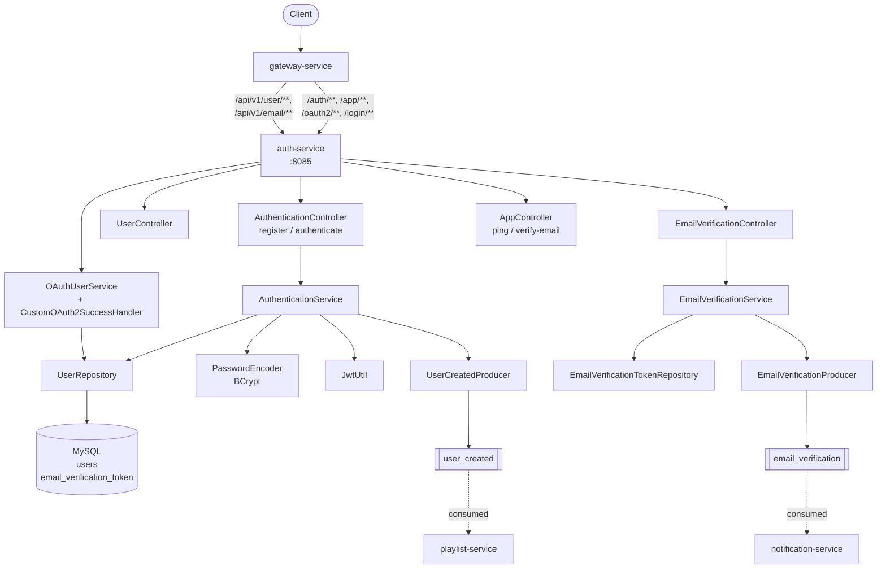
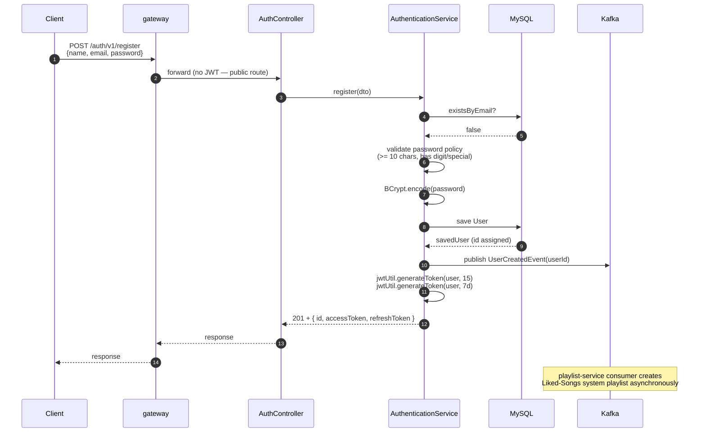
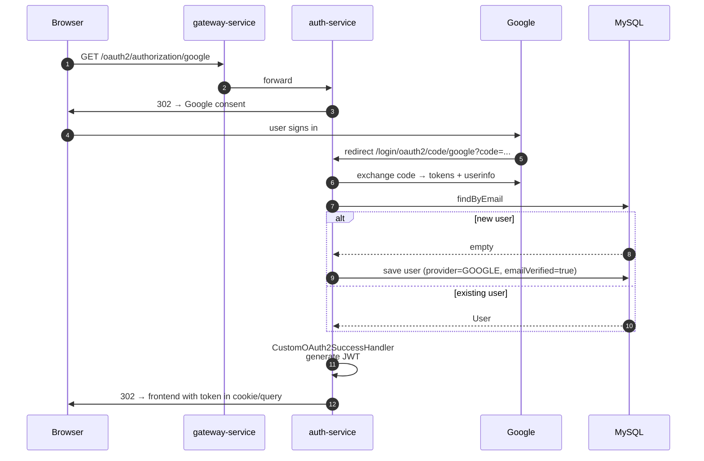
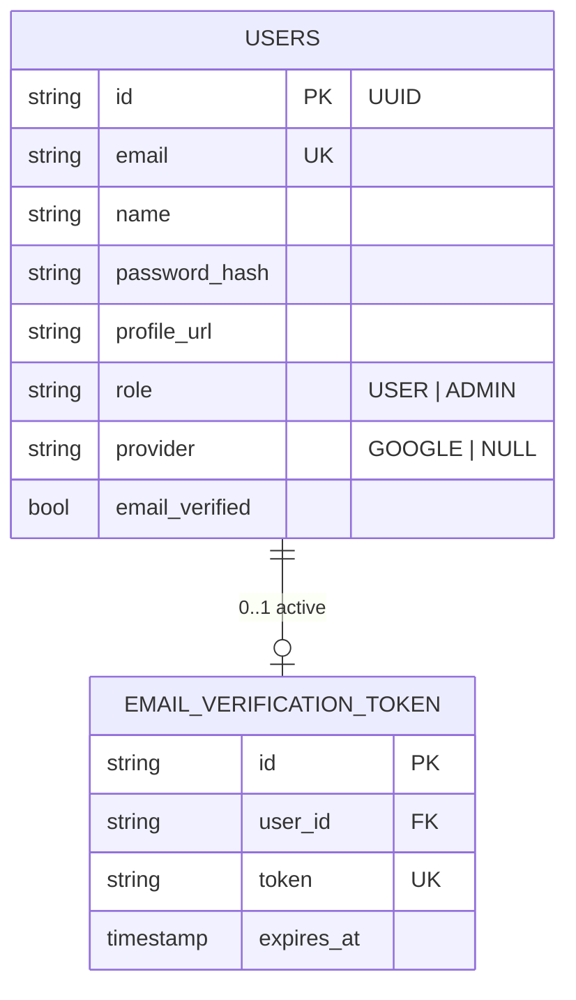

# auth-service

Owns user identity. Handles registration, password-based login, OAuth2 (Google) sign-in, JWT issuance + refresh, and email verification. Is the only service that touches the `users` table; downstream services know users by `userId` only.

## Responsibilities

- Register users with BCrypt-hashed passwords + strong-password policy
- Authenticate password logins, issue access + refresh JWTs (15 min / 7 days)
- OAuth2 authorization-code flow against Google; provision local user on first sign-in
- Publish `user_created` events so playlist-service can provision a Liked-Songs playlist
- Publish `email_verification` events so notification-service can send the verification email
- Validate and consume email verification tokens

## Architecture



## Registration Flow



## OAuth2 (Google) Sign-In



## REST API

| Method | Path | Auth | Purpose |
|---|---|---|---|
| POST | `/auth/v1/register` | public | New user signup |
| POST | `/auth/v1/authenticate` | public | Password login |
| POST | `/auth/v1/validateEmail` | public | Check if email already registered |
| GET | `/app/v1/ping` | public | Health probe |
| GET | `/app/v1/verify-email?token=...` | public | Redeem email verification token |
| GET | `/oauth2/authorization/google` | public | Start Google OAuth2 flow |
| GET | `/login/oauth2/code/google` | public | OAuth2 callback (Google → us) |

`/api/v1/user/**` and `/api/v1/email/**` cover authenticated user-profile and email-change endpoints — see the controllers for the full surface.

### Example — Register

```bash
curl -X POST http://localhost:8080/auth/v1/register \
  -H "Content-Type: application/json" \
  -d '{ "name": "Alice", "email": "alice@example.com", "password": "StrongPass1!" }'
```

Response:

```json
{
  "success": true,
  "message": "User registered successfully",
  "data": {
    "id": "5b71...uuid",
    "accessToken": "eyJhbGc...",
    "refreshToken": "eyJhbGc..."
  }
}
```

## Persistence Model



The `users` table also has a `@ManyToMany` to a local `Artist` entity via `artist_following` (which catalog-service also reads from via raw `JdbcTemplate` — see catalog-service's README for that boundary).

## Eventing

| Direction | Topic | Event | When |
|---|---|---|---|
| Produces | `user_created` | `UserCreatedEvent { userId }` | After successful registration (password + OAuth2) |
| Produces | `email_verification` | `EmailVerificationEvent { email, verificationLink }` | When a verification link is requested |

Both producers swallow Kafka failures (logged but non-fatal) so a downstream Kafka outage doesn't block user signup.

## Configuration

Local `application.properties`:

```properties
spring.application.name=auth-service
server.port=8085
spring.config.import=optional:file:../env.properties,optional:configserver:http://localhost:8888
```

From `centralconfigs/auth-service/auth-service.properties`:

- `spring.datasource.*` — MySQL connection
- `spring.jpa.hibernate.ddl-auto=update`
- `jwt.secret-key=${JWT_SECRET_KEY}` — HS256 signing key (must be ≥ 32 bytes)
- `frontend.url`, `backend.url` — for OAuth redirect + email links
- `spring.security.oauth2.client.registration.google.*` — Google OAuth2 client config
- `spring.kafka.producer.*` — Kafka serializers + auto-create topics
- `server.error.include-message=always`

## Testing

| Test | What it covers |
|---|---|
| `AuthenticationServiceTest` | Service logic with mocked repository + producer |
| `EmailVerificationServiceTest` | Token generation, expiry, redemption |
| `UserServiceTest` | Profile read/update logic |
| `JwtUtilTest` | Token issuance + claim extraction round-trip |
| `AuthenticationControllerTest` | `@WebMvcTest` slice — HTTP wiring + validation |
| `InternalTrafficFilterTest` | Gateway-secret enforcement |
| `AuthenticationServiceIT` | `@SpringBootTest` with real MySQL via Testcontainers — register + authenticate end-to-end with real BCrypt + JWT |
| `KafkaPublishingIT` | Real Kafka container — verifies `user_created` and `email_verification` events round-trip |

```bash
cd auth-service && ./mvnw test
```

## Local Development

```bash
cd auth-service
./mvnw spring-boot:run
```

Required env (in `env.properties` at repo root, or as real env vars):

- `JWT_SECRET_KEY` (≥ 32 bytes)
- `GOOGLE_CLIENT_ID`, `GOOGLE_CLIENT_SECRET` (or OAuth2 endpoints will 500)
- `DATASOURCE_*`
- `KAFKA_URL`
- `BACKEND_URL`, `FRONTEND_URL`

## Boot Order

discovery-service → config-server → auth-service. Other backend services don't depend on auth-service for startup, but the Kafka consumers in playlist-service / notification-service expect events from here.
