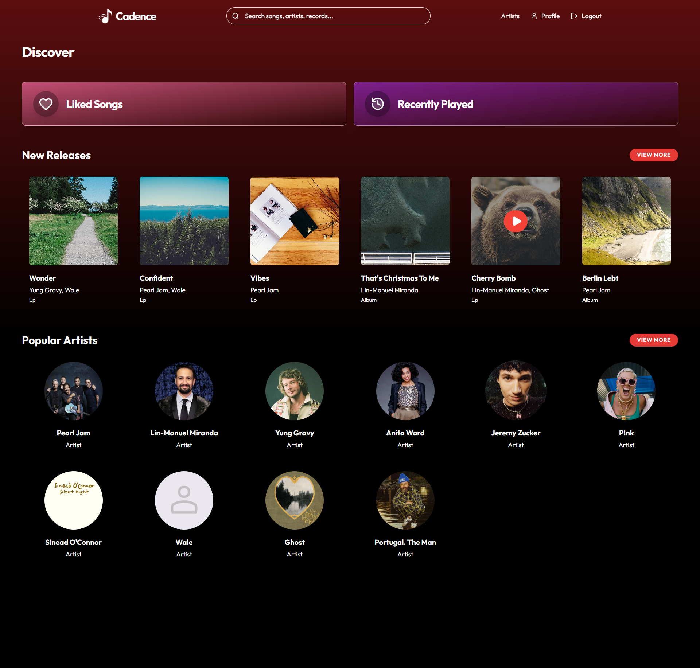
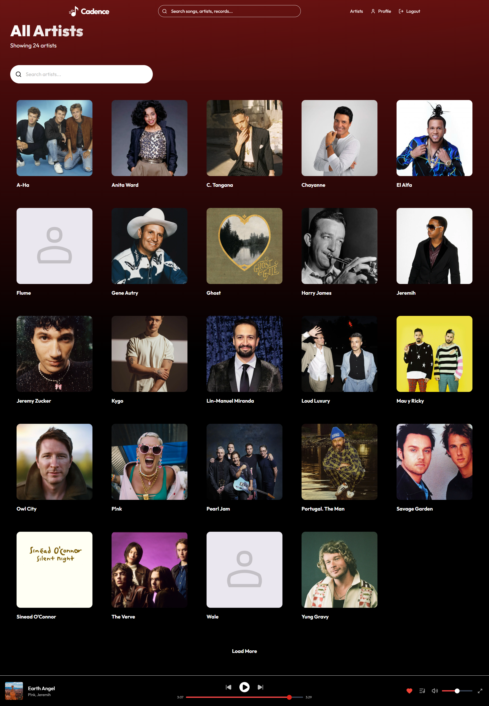
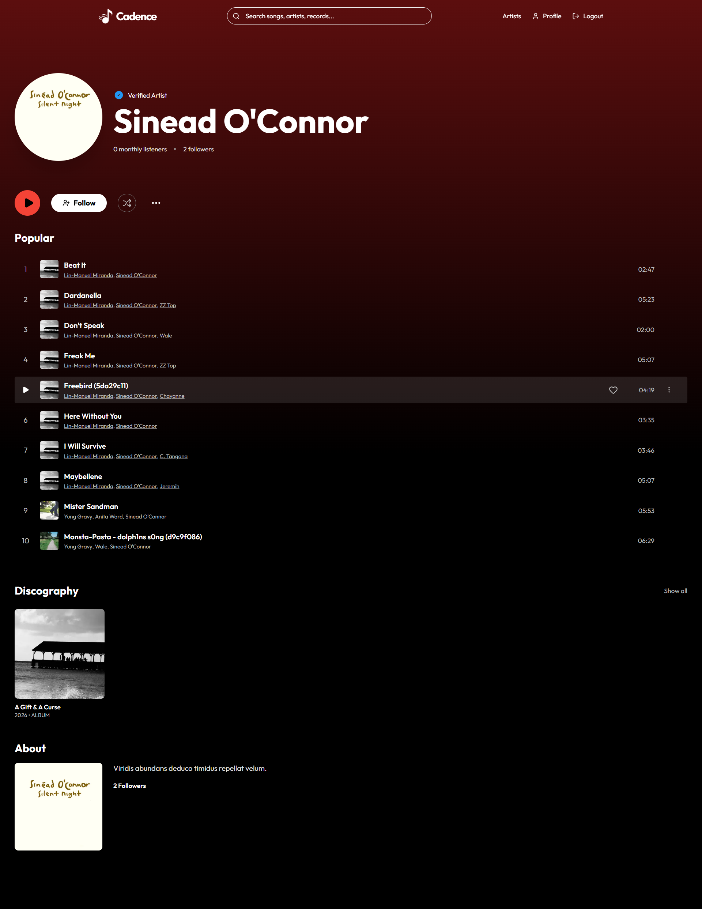
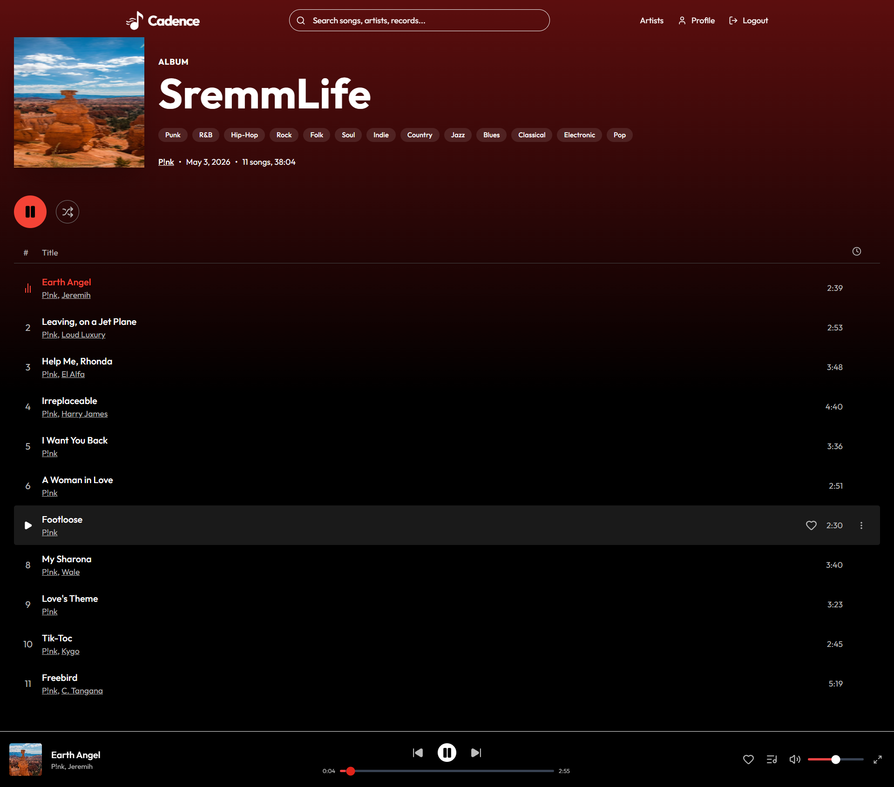
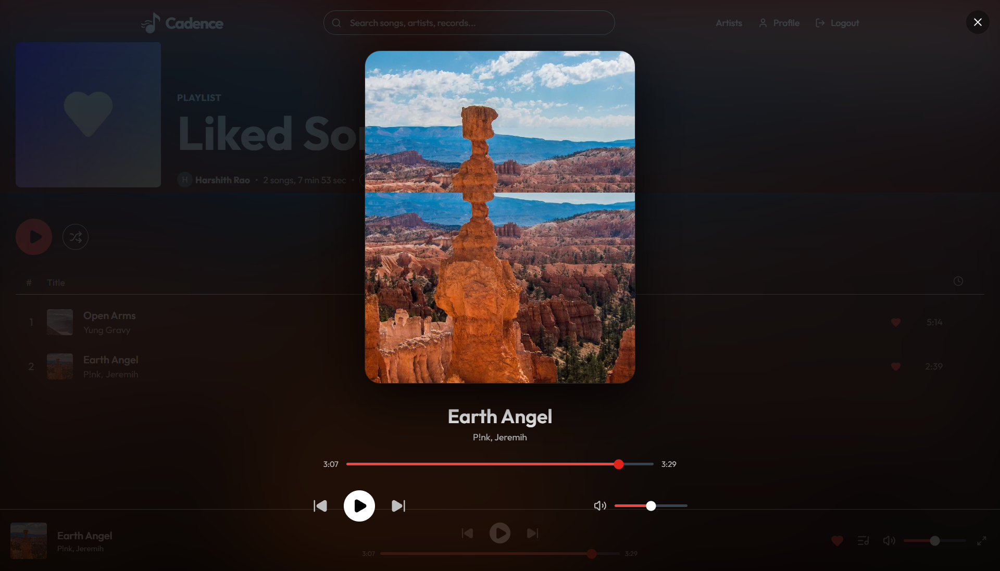
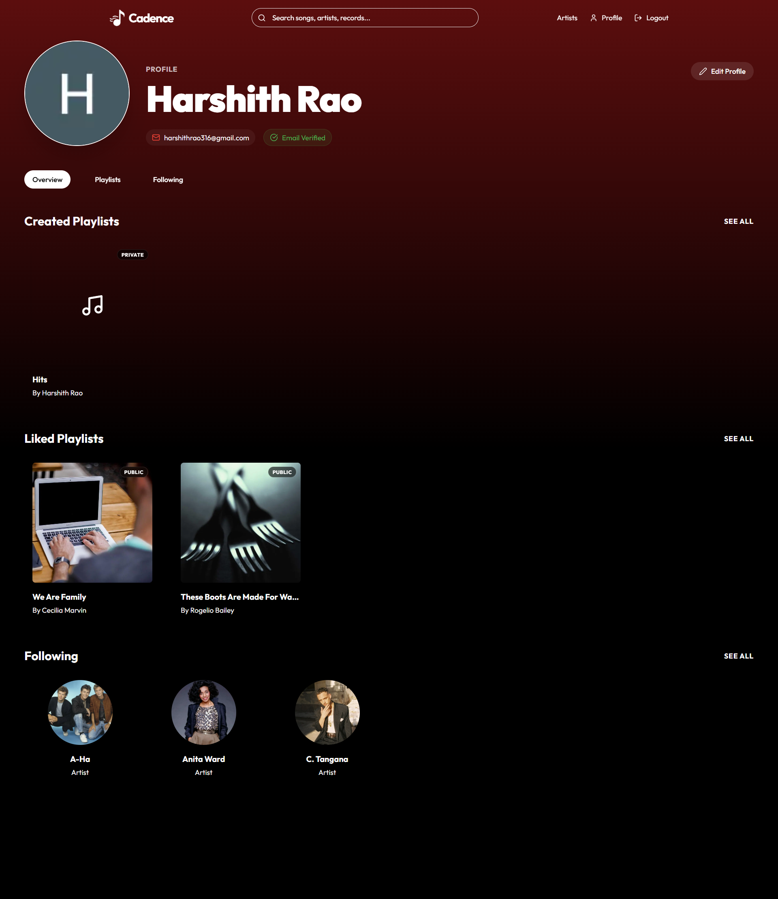
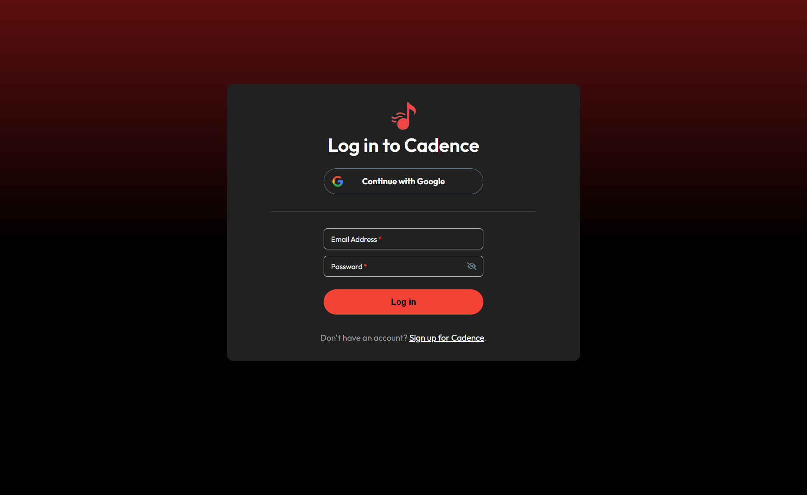
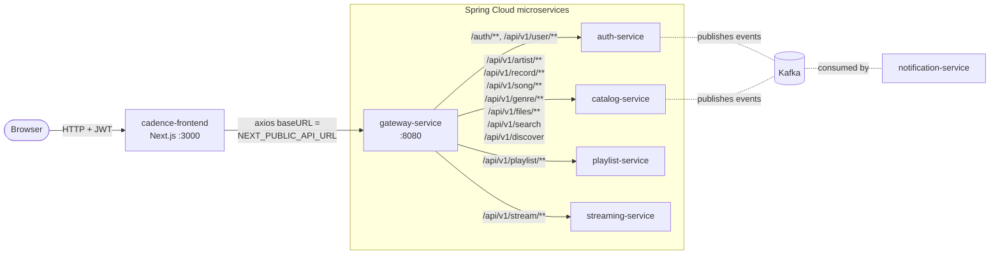
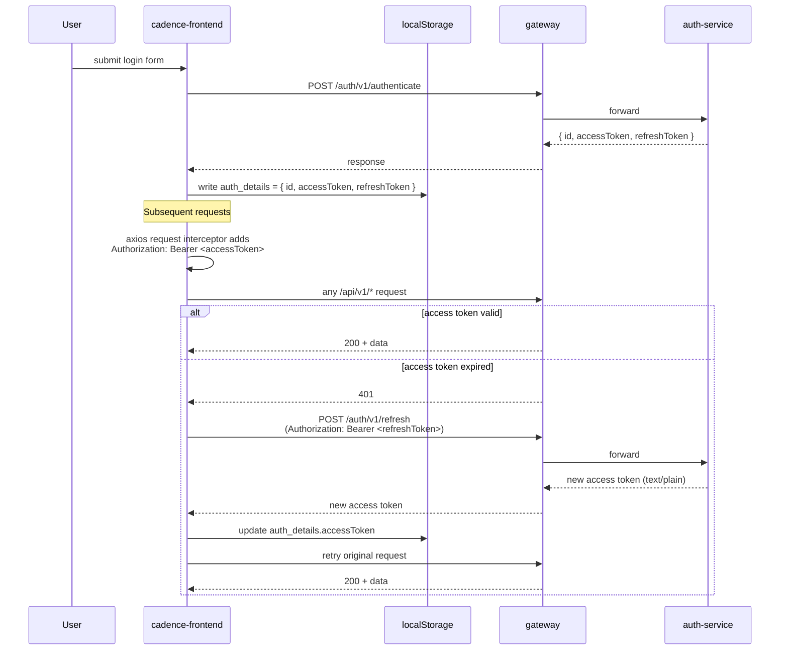

# cadence-frontend

A Next.js 16 / React 19 web client for the [Cadence](../) music streaming backend. Browses artists/records/songs, manages playlists, streams audio with byte-range buffering, supports password + Google OAuth2 login, and includes admin flows for catalog management.

> Backend repo: this is part of a Spring Cloud microservices monorepo. See the [root README](../README.md) for the architecture and how to bring the backend up.

## Screenshots

All screenshots live in [`docs/screenshots/`](docs/screenshots/).

### Home / Discover



### Artists Listing



### Artist Profile



### Record Detail



### Playlist (Liked Songs)



### User Profile



### Login



## Tech Stack

- **Framework**: Next.js 16 (App Router, Turbopack), React 19
- **Language**: TypeScript
- **Styling**: Tailwind CSS 4 + Material Tailwind components
- **Animation**: Framer Motion
- **Icons**: Lucide React, Heroicons, react-icons
- **HTTP**: Axios with interceptors for JWT + auto-refresh
- **Toast / Notifications**: Sonner
- **Date utilities**: date-fns

## Architecture



The frontend never talks to backend services directly — every request goes through the gateway, which validates the JWT, injects `X-User-Id` and `X-Gateway-Secret` headers, and load-balances by service name via Eureka.

## Pages and Routes

| Path | Page | What it does |
|---|---|---|
| `/` | Home | Discover feed: trending songs, popular artists, new releases, recommendations, recently played |
| `/section/[type]` | Section detail | Drill into a single discover section (e.g., all trending songs) |
| `/auth/login` | Login | Email + password, with link to OAuth2 Google sign-in |
| `/auth/signup` | Signup | Register with email validation; success redirects to `/auth/success` |
| `/auth/success` | OAuth callback landing | Receives JWTs from the gateway and stores them in localStorage |
| `/artists/[id]` | Artist profile | Bio, popular songs, records, follow/unfollow, follower count |
| `/records/[id]` | Record detail | Track listing, add-to-playlist, admin delete |
| `/records/add` | Admin: add record | Multipart upload to S3 (cover + audio files per song) via presigned URLs |
| `/playlist/[id]` | Playlist detail | Songs, owner, like/unlike, add/remove songs, edit |
| `/profile/[id]` | User profile | Created and liked playlists, name + avatar editing, email verification |

## API Layer

`src/lib/api.ts` configures a single axios instance:

- `baseURL` from `NEXT_PUBLIC_API_URL` (typically `http://localhost:8080/`)
- **Request interceptor** — reads `auth_details.accessToken` from localStorage and adds `Authorization: Bearer <token>`
- **Response interceptor** — on `401`, transparently calls `POST /auth/v1/refresh` with the refresh token, updates localStorage, and retries the original request. On second failure, clears auth state and redirects to `/auth/login`
- **Error toasts** — any `4xx`/`5xx` other than 401 surfaces the backend `ApiResponseDTO.message` via Sonner

The audio player (`src/context/PlayerContext.tsx`) uses raw `fetch` instead of axios because it needs `Range` headers for byte-range streaming and direct access to the response body as a stream. It hits `/api/v1/stream/song/{songId}` and handles HTTP 206 Partial Content for seekable playback.

## Getting Started

### Easiest: Docker (whole stack)

The frontend is part of the dockerised stack. From the repo root:

```bash
docker compose up --build -d
```

This builds the frontend image (multi-stage Next.js standalone) and runs it on `:3000`, pointed at the dockerised gateway on `:8080`. See the [root README](../README.md) for the full flow.

### Active development on the frontend (HMR)

Run the backend in Docker and the frontend on your host so you get Turbopack hot-reload:

```bash
docker compose up -d --scale frontend=0   # stack without the frontend container
cd cadence-frontend
npm install

# .env.local
echo "NEXT_PUBLIC_API_URL=http://localhost:8080/" > .env.local

npm run dev
```

Note the trailing slash on `NEXT_PUBLIC_API_URL` — the axios `baseURL` concatenation expects it.

### Other scripts

```bash
npm run build   # production build
npm run start   # serve the production build
npm run lint    # ESLint
```

## Project Structure

```
cadence-frontend/
├── src/
│   ├── app/                    # Next.js App Router pages
│   │   ├── page.tsx            # Home / discover
│   │   ├── layout.js           # Root layout: nav, player, providers
│   │   ├── auth/               # login, signup, success
│   │   ├── artists/[id]/       # artist profile
│   │   ├── records/[id]/       # record detail
│   │   ├── records/add/        # admin add-record flow
│   │   ├── playlist/[id]/      # playlist detail
│   │   ├── profile/[id]/       # user profile
│   │   └── section/[type]/     # discover section drill-in
│   ├── components/
│   │   ├── artists/            # AddArtist, ArtistCard, ...
│   │   ├── songs/              # SongOptionsMenu, ...
│   │   ├── search/             # GlobalSearch
│   │   └── ...
│   ├── context/                # React contexts
│   │   ├── UserContext.tsx     # current user, playlist mutations
│   │   ├── PlayerContext.tsx   # audio player + queue + buffer cache
│   │   ├── ArtistContext.tsx
│   │   ├── RecordContext.tsx
│   │   ├── SongContext.tsx
│   │   └── GenreContext.tsx
│   ├── lib/
│   │   ├── api.ts              # axios instance + JWT auto-refresh interceptor
│   │   └── utility.ts
│   └── types/                  # TypeScript DTOs mirroring backend ApiResponseDTO/DTO shapes
├── public/                     # static assets
├── docs/screenshots/           # README images (PNGs)
├── Dockerfile                  # multi-stage build → Next.js standalone
├── .dockerignore
├── package.json
├── next.config.mjs
└── tsconfig.json
```

## Authentication Flow



## Troubleshooting

- **CORS errors in browser** — the gateway needs to allow `http://localhost:3000` as an origin. Check the gateway's CORS config.
- **Login succeeds but every API call returns 401** — `NEXT_PUBLIC_API_URL` probably doesn't end with `/`. The interceptor's URL concatenation breaks otherwise.
- **Audio playback returns 404** — confirm `streaming-service` is registered with Eureka. The path is `/api/v1/stream/song/{songId}` (note: stream/song, not song/stream).
- **Refresh loop redirects to /auth/login** — refresh token expired (7-day TTL by default). User has to log in again.
- **Discover page empty** — `streaming-service` and `playlist-service` need to be running. With Resilience4j fallbacks the page still loads, but trending/recommended/playlist sections will be empty until those services come up.

## Linking to Backend

The frontend assumes:
- Gateway at `NEXT_PUBLIC_API_URL` (default `http://localhost:8080/`)
- JWT issued by auth-service (15 min access token, 7 day refresh)
- All routes go through the gateway — direct backend ports are gateway-secret-protected and not callable from the browser
