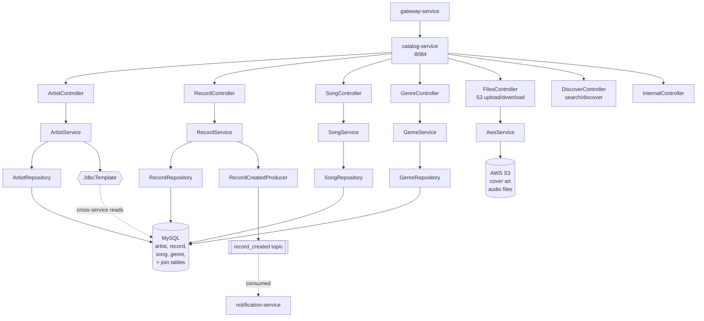
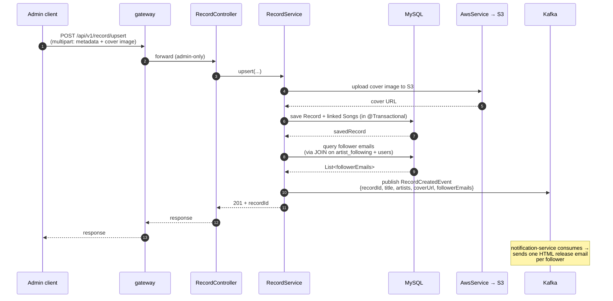
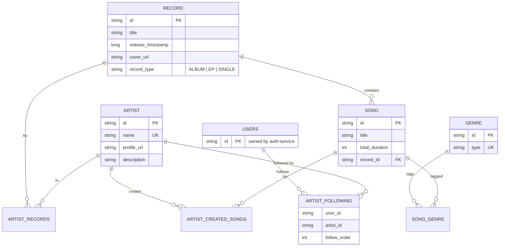

# catalog-service

Owns the music catalog: artists, records (albums/EPs/singles), songs, genres. Handles admin-side uploads to S3 (cover art + audio), public read APIs for browsing, social actions like follow/unfollow, and search/discover.

## Responsibilities

- CRUD for `Artist`, `Record`, `Song`, `Genre`
- Follow / unfollow artists; expose follower lists
- S3 upload + signed URL generation for cover art and audio files
- Search across artists/records/songs and a "discover" feed
- Publish `record_created` events for notification-service to fan out follower emails
- Provide internal endpoints (`/internal/**`) used by Feign clients in other services

## Architecture



## Cross-Service Read Boundary

`ArtistService` issues raw `JdbcTemplate` queries against two tables it does **not** own:

| Table | Owner | Used in catalog-service for |
|---|---|---|
| `users` | auth-service | `userExists(userId)` check before follow/unfollow; `getArtistFollowers()` |
| `artist_following` | (shared social table) | follow / unfollow / isFollowing / getArtistFollowers |

This is a deliberate pragmatic shortcut — going through Feign for every `userExists` check would be a chatty extra round-trip. The contract is: if auth-service ever renames `users.id`, this service will break. Integration tests assert the exact column names so a rename surfaces fast.

## Record Creation Flow



## REST API

All public routes are under `/api/v1/` and reachable through the gateway.

### Artists (`/api/v1/artist`)

| Method | Path | Role | Purpose |
|---|---|---|---|
| POST | `/upsert` | ADMIN | Create or update artist + profile image |
| DELETE | `/delete/{artistId}` | ADMIN | Delete artist + cascade cleanup of join tables + S3 image |
| GET | `/all?page=&size=&key=` | public | Paginated artist listing with optional name filter |
| GET | `/{artistId}` | public | Artist profile + recent records + popular songs + follower count |
| POST | `/{artistId}/follow` | user | Add to current user's follow list (ordered) |
| POST | `/{artistId}/unfollow` | user | Remove from follow list |
| GET | `/{artistId}/isFollowing` | user | Boolean check |
| GET | `/{artistId}/followers` | public | Follower list (paginated) |

### Records (`/api/v1/record`)

| Method | Path | Role | Purpose |
|---|---|---|---|
| POST | `/upsert` | ADMIN | Create or update record + songs + cover art |
| DELETE | `/delete/{recordId}` | ADMIN | Delete record |
| GET | `/all?artistId=` | public | All records by an artist, newest first |
| GET | `/{recordId}` | public | Record detail with songs |

### Songs (`/api/v1/song`)

| Method | Path | Purpose |
|---|---|---|
| GET | `/all?recordId=` | All songs in a record (ordered) |
| GET | `/{songId}` | Song detail |

### Genres (`/api/v1/genre`)

| Method | Path | Role | Purpose |
|---|---|---|---|
| POST | `/add` | ADMIN | Create genre |
| GET | `/all?page=&size=&key=` | public | Paginated genre listing with name filter |

### Files & Discovery

| Method | Path | Purpose |
|---|---|---|
| `/api/v1/files/**` | `FilesController` | S3 upload (admin) + signed URL retrieval |
| GET | `/api/v1/search?key=` | Cross-entity search (artists + records + songs + playlists) |
| GET | `/api/v1/discover` | Recommendation feed: popular artists, new releases, suggested by liked genres |

### Internal (`/internal/**`)

Used by Feign clients in other services (catalog preview lookups). Protected by `InternalTrafficFilter` (gateway-secret header).

## Persistence Model



## Eventing

| Direction | Topic | Event | When |
|---|---|---|---|
| Produces | `record_created` | `RecordCreatedEvent { recordId, recordTitle, artists, coverUrl, followerEmails }` | After a record is saved + commit |

The producer pre-fetches follower emails synchronously (so the consumer doesn't have to call back into catalog-service). Topic auto-created via `NewTopic` bean (3 partitions, 1 replica).

## Cross-Cutting Concerns

- **Outbound Feign calls** (`PlaylistClient` for global search, `StreamingStatsClient` for the discover feed) go through `FeignClientConfig.gatewaySecretInterceptor` which stamps `X-Gateway-Secret` on every request. Without it, the destination's `InternalTrafficFilter` would 403 the call.
- **Resilience4j circuit breakers** wrap both Feign clients. `PlaylistClientFallback` returns an empty `ApiResponseDTO` so search still returns artists/records/songs when `playlist-service` is down. `StreamingStatsClientFallback` returns empty trending/recently-played/top-songs sections so the discover feed still renders the popular-artists and new-releases sections when `streaming-service` is down.
- **`/actuator/refresh` rebinds `gateway.secret`** via `GatewaySecretProperties` for hot rotation without a restart.

## Configuration

Local `application.properties`:

```properties
spring.application.name=catalog-service
server.port=8084
spring.config.import=optional:file:../env.properties,optional:configserver:http://localhost:8888
```

From `centralconfigs/catalog-service/catalog-service.properties`:

- `spring.datasource.*` — MySQL
- `spring.jpa.hibernate.ddl-auto=update`
- `cloud.aws.credentials.*`, `cloud.aws.region.static`, `cloud.aws.s3.bucket` — S3 client
- `spring.servlet.multipart.*` — 10 MB upload cap
- `server.tomcat.max-swallow-size=-1` — needed for large multipart uploads
- `spring.kafka.producer.*` + `spring.kafka.admin.auto-create=true`

## Testing

| Test | What it covers |
|---|---|
| `ArtistServiceTest` | Follow/unfollow logic, error paths (mocked JdbcTemplate) |
| `GenreServiceTest`, `SongServiceTest`, `RecordServiceTest` | Service-level logic with mocked repositories |
| `ArtistControllerTest`, `GenreControllerTest`, `SongControllerTest`, `RecordControllerTest` | `@WebMvcTest` slices |
| `InternalTrafficFilterTest` | Gateway-secret enforcement |
| `ArtistServiceIT` | Full integration with real MySQL — follow/unfollow happy path + edge cases (already-following, missing user, missing artist, follow-order increment) |
| `RecordKafkaIT` | Real Kafka container — `record_created` publish + JSON round-trip |

The integration tests are non-trivial here because `ArtistService` mixes JPA and raw `JdbcTemplate` against tables this service doesn't own. A small `test-schema.sql` provisions `users` and `artist_following` in the MySQL container so the cross-service queries work.

```bash
cd catalog-service && ./mvnw test
```

## Local Development

```bash
cd catalog-service
./mvnw spring-boot:run
```

Required env:

- `DATASOURCE_*`, `KAFKA_URL`
- `AWS_ACCESS_KEY`, `AWS_SECRET_KEY`, `AWS_REGION`, `AWS_S3_BUCKET` — needed for FilesController to work; if you skip these, S3 uploads will fail but other endpoints still work.

## Boot Order

discovery-service → config-server → catalog-service. Doesn't depend on auth-service for startup, but the cross-service `users` / `artist_following` queries return empty until auth-service has created some users.
