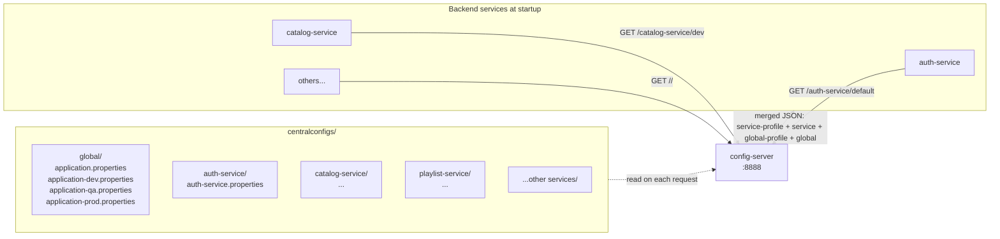
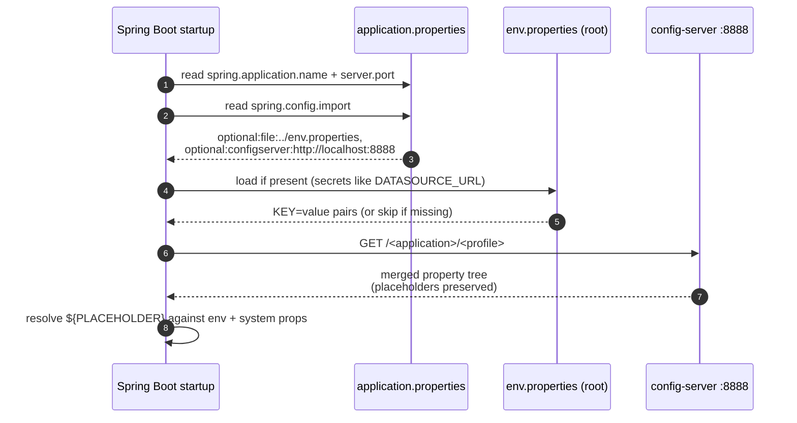

# config-server

A Spring Cloud Config Server using the `native` filesystem backend. Serves configuration files from `centralconfigs/` to every other backend service at startup so each service has a near-empty `application.properties` and pulls everything else from here.

## Architecture



## Repository Layout

```text
config-server/
├── src/main/                        # the @EnableConfigServer app
└── centralconfigs/
    ├── global/
    │   ├── application.properties              # shared by all services, all envs
    │   ├── application-dev.properties          # dev overrides, all services
    │   ├── application-qa.properties
    │   └── application-prod.properties
    ├── auth-service/
    │   └── auth-service.properties
    ├── catalog-service/
    │   └── catalog-service.properties
    ├── playlist-service/
    ├── streaming-service/
    ├── notification-service/
    └── gateway-service/
```

When a client requests `GET /auth-service/dev`, the server returns the merged property tree built from these sources (later wins for duplicate keys):

| Order | Source | Notes |
|---:|---|---|
| 1 (highest) | `auth-service/auth-service-dev.properties` | per-service-per-env override (if present) |
| 2 | `global/application-dev.properties` | env override, all services |
| 3 | `auth-service/auth-service.properties` | service base |
| 4 (lowest) | `global/application.properties` | shared base |

## Resolution Flow on a Client



Two important properties of this design:

- **Server returns text, not values.** Placeholder strings like `${DATASOURCE_URL}` are preserved as-is. The CLIENT resolves them at startup against its own environment / `env.properties` — secrets never live in the served config.
- **`optional:` prefix** on both imports means a missing file or unreachable server doesn't crash the client. Tests rely on this — they override everything from `application-test.properties` and never need the config-server running.

## Configuration

```properties
spring.application.name=config-server
server.port=8888

spring.profiles.active=native
spring.cloud.config.server.native.search-locations=\
  file:./centralconfigs/global/,\
  file:./centralconfigs/{application}/
```

The `{application}` placeholder is substituted with the requesting service's name on each request — that's what makes the per-service folder layout work.

## Local Development

```bash
cd config-server
./mvnw spring-boot:run
```

Verify it's serving correctly:

```bash
curl http://localhost:8888/auth-service/default | jq
curl http://localhost:8888/catalog-service/prod | jq
curl http://localhost:8888/auth-service/dev | jq '.propertySources[].name'
```

The third command shows the source list in merge order — top of the array wins.

## Adding Configuration

- **Shared across all services**: add to `centralconfigs/global/application.properties` (or the env-specific variant).
- **One service, all environments**: add to `centralconfigs/<service>/<service>.properties`.
- **One service, one environment**: create `centralconfigs/<service>/<service>-<profile>.properties`.

After editing, restart config-server. (For hot-reload without restart, switch the backend from `native` to `git` and call `/actuator/refresh` on clients — not currently set up.)

## Why Native Backend

The conventional production pattern is git-backed (`spring.cloud.config.server.git.uri=...`), where the server pulls from a separate config repo. Reasons to switch eventually:

- Config can change without rebuilding/restarting config-server (server pulls fresh on each request)
- Config history independent of app code history
- PR review workflow for config changes
- Multiple environments pointing at branches in the same repo

For this monorepo with one local dev workflow, **native is simpler**: one folder = one deployable unit, no extra git repo to maintain.

## Boot Order

Bring up after `discovery-service` and before any client service that needs centralized config. Clients with `optional:configserver:` will start without it, but their placeholders won't resolve.
