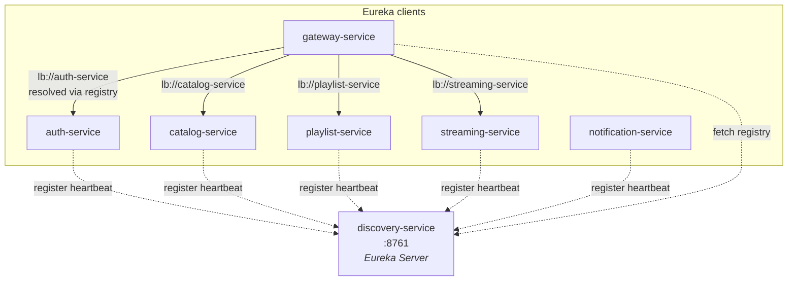

# discovery-service

A Spring Cloud Netflix Eureka server. Every other backend service registers here at startup, and the gateway uses it to resolve `lb://<service-name>` to a live instance.

This service contains no business logic — it's pure infrastructure. Bring it up first; everything else depends on it.

## Architecture



Two roles for the registry:

- **Producer-side**: every backend service registers itself with `eureka.client.register-with-eureka=true` and sends heartbeats. If a service stops sending heartbeats, Eureka evicts it after the lease-expiration window.
- **Consumer-side**: the gateway and Feign clients fetch the registry (`fetch-registry=true`) so they can resolve service names like `lb://playlist-service` to actual `host:port` instances.

## Configuration

```properties
spring.application.name=discovery-service
server.port=8761

# It's the registry itself — don't try to register with anyone or fetch a registry.
eureka.client.register-with-eureka=false
eureka.client.fetch-registry=false
```

This service does not pull from config-server. It has no env-driven settings and is intentionally self-contained so that bringing the registry up doesn't depend on any other component.

## Local Development

```bash
cd discovery-service
./mvnw spring-boot:run
```

Then open <http://localhost:8761>. The dashboard lists every registered application and instance. As you start the other services, they appear within ~30 seconds.

## Boot Order

This service must be running **before** any service that has `eureka.client.register-with-eureka=true` (which is everything except itself). If you start a backend service first, it will repeatedly log connection-refused warnings until Eureka comes up — it doesn't crash, but it won't be reachable through the gateway either.

## Why Eureka Specifically

Picked because:

- Spring Cloud first-class integration; no extra runtime dependencies (no etcd / Consul to operate).
- Heartbeat-based eviction works well for the small instance counts in this monorepo.
- Local dev is one `mvn spring-boot:run` away — no external server needed.
