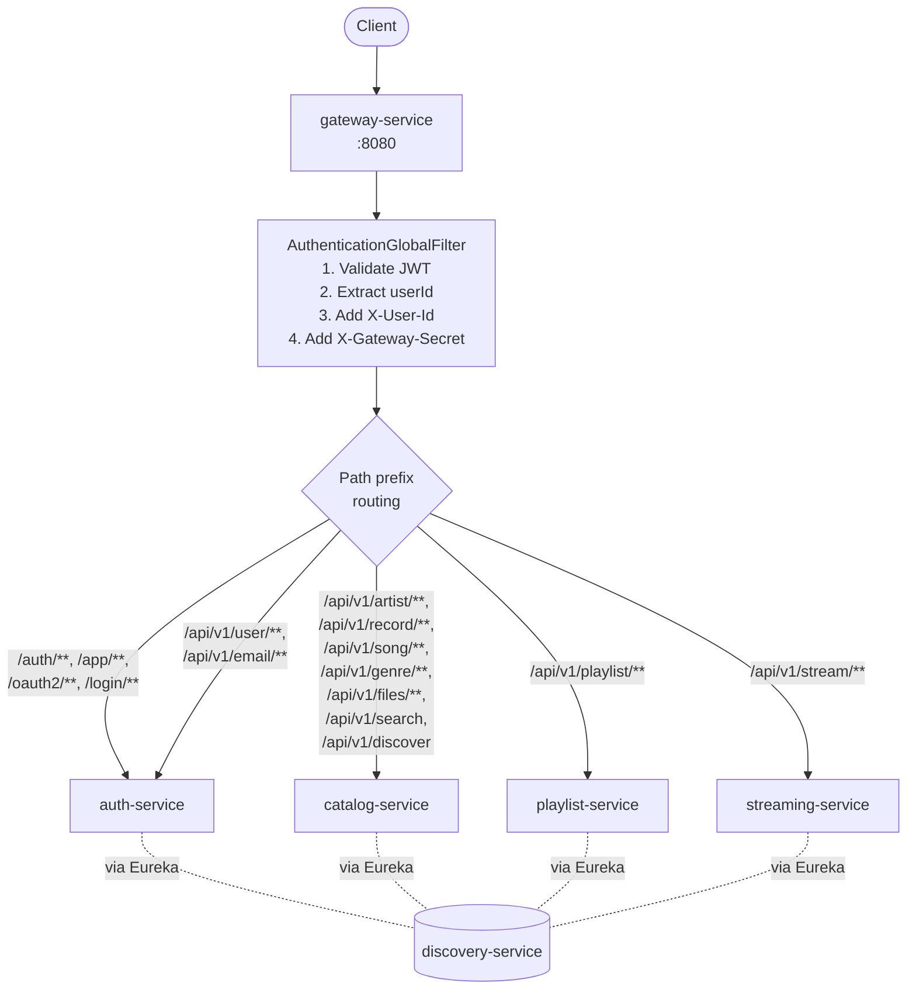
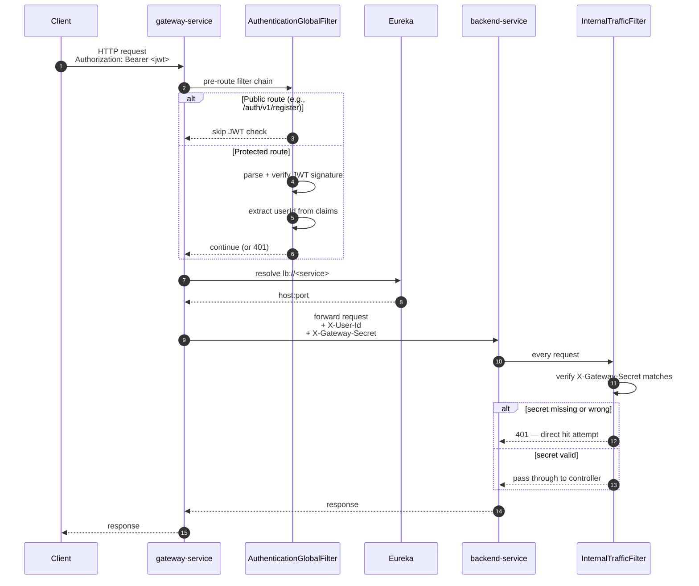
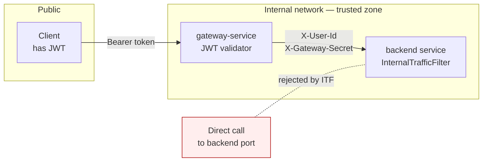

# gateway-service

The single public-facing process. All client traffic terminates here. Spring Cloud Gateway routes by path prefix to the correct backend service via Eureka load-balancing, validates JWTs once at the edge, and stamps every forwarded request with `X-User-Id` and `X-Gateway-Secret` headers so downstream services can trust the caller.

## Architecture



## Request Flow



## Routes

Routes live in `config-server/centralconfigs/gateway-service/gateway-service.properties` and are pulled at startup. Path prefix → `lb://<service>`:

| ID | Path predicates | Target |
|---|---|---|
| `auth-service-auth` | `/auth/**`, `/app/**`, `/oauth2/**`, `/login/**` | `lb://auth-service` |
| `auth-service-user` | `/api/v1/user/**`, `/api/v1/email/**` | `lb://auth-service` |
| `catalog-service` | `/api/v1/artist/**`, `/api/v1/record/**`, `/api/v1/song/**`, `/api/v1/genre/**`, `/api/v1/files/**`, `/api/v1/search`, `/api/v1/discover` | `lb://catalog-service` |
| `playlist-service` | `/api/v1/playlist/**` | `lb://playlist-service` |
| `streaming-service` | `/api/v1/stream/**` | `lb://streaming-service` |

Adding or changing a route is a config change in `gateway-service.properties` — restart the gateway to pick it up.

## Authentication & Header Injection

`AuthenticationGlobalFilter` is a `GlobalFilter` (runs on every route). Its job:

1. **Skip on public routes** — anything under `/auth/**`, `/app/**`, `/oauth2/**`, `/login/**` is unauthenticated.
2. **Validate JWT** for everything else: parse `Authorization: Bearer <jwt>`, verify signature against `JWT_SECRET_KEY`, check expiry.
3. **Extract `userId`** from the JWT's `userId` claim.
4. **Mutate the downstream request** to add:
   - `X-User-Id: <userId>` — so backend services don't need to re-parse the JWT.
   - `X-Gateway-Secret: <GATEWAY_SECRET>` — proves to backend services that the request came through the gateway.

If the JWT is missing or invalid on a protected route, the gateway returns `401` without ever touching the backend.

## Inter-Service Authentication Boundary



Two layers, both required:

- **JWT** — proves the caller is a logged-in user.
- **Gateway secret** — proves the request came through the gateway, not a direct hit on the backend service's port.

## Configuration

Local `application.properties`:

```properties
spring.application.name=gateway-service
server.port=8080
spring.config.import=optional:file:../env.properties,optional:configserver:http://localhost:8888
```

From `centralconfigs/global/application.properties`:

```properties
gateway.secret=${GATEWAY_SECRET}
eureka.client.service-url.defaultZone=${EUREKA_SERVER_URL:http://localhost:8761/eureka}
eureka.client.register-with-eureka=true
eureka.client.fetch-registry=true
```

From `centralconfigs/gateway-service/gateway-service.properties`: the route definitions (table above).

## Local Development

```bash
cd gateway-service
./mvnw spring-boot:run
```

Boot order: discovery-service → config-server → backend services → gateway. The gateway will return `503 Service Unavailable` for any route whose target service hasn't registered with Eureka yet.

## Why Spring Cloud Gateway

Picked over Zuul / Nginx for two reasons:

- **Reactive request pipeline** based on Project Reactor — non-blocking I/O, scales to many concurrent connections without thread-per-request overhead.
- **First-class Spring Cloud integration** — `lb://` resolution via Eureka and `GlobalFilter`s for JWT/header injection are native concepts, no glue code.
