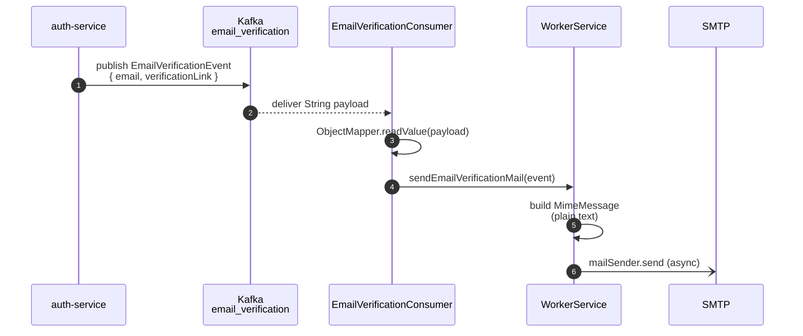
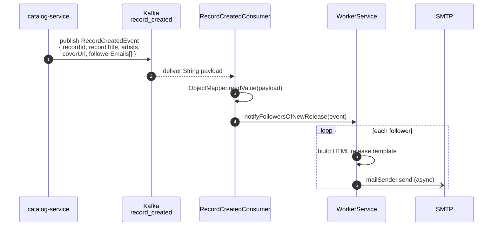

# notification-service

Pure Kafka consumer — no HTTP routes, no database. Listens to two topics and sends emails via SMTP. The simplest service in the monorepo.

## Responsibilities

- Consume `email_verification` events → send "verify your email" plain-text mail
- Consume `record_created` events → send "new release from <artist>" HTML mail to every follower in the event payload
- Each outbound mail send runs `@Async` so a slow SMTP server doesn't block the Kafka consumer thread

## Architecture

```mermaid
flowchart LR
    subgraph upstream[Upstream producers]
        auth[auth-service<br/>EmailVerificationProducer]
        catalog[catalog-service<br/>RecordCreatedProducer]
    end

    auth -.publish.-> kev[[email_verification]]
    catalog -.publish.-> krc[[record_created]]

    subgraph notif[notification-service :8081]
        evc[EmailVerificationConsumer]
        rcc[RecordCreatedConsumer]
        ws[WorkerService]
    end

    kev --> evc
    krc --> rcc

    evc -->|@KafkaListener| ws
    rcc -->|@KafkaListener| ws

    ws -->|MimeMessageHelper<br/>+ HTML template| smtp[(SMTP<br/>e.g. Gmail)]
```

## Consumer Pipelines

### Email Verification



### New Release Notification



## Topic + Group Map

| Topic | Group ID | Consumer | Handler |
|---|---|---|---|
| `email_verification` | `notification-service-email-verification` | `EmailVerificationConsumer` | `WorkerService.sendEmailVerificationMail` |
| `record_created` | `cadence-group` | `RecordCreatedConsumer` | `WorkerService.notifyFollowersOfNewRelease` |

Each consumer takes a raw `String` payload and uses `ObjectMapper` for deserialization rather than relying on the Spring Kafka `JsonDeserializer` — keeps the wire format explicit and means producers and consumers don't have to share an event class on the classpath.

## Email Templates

`WorkerService.sendReleaseMail` builds an inline HTML template (no template engine, just a Java text block). The release email includes:

- Subject: `New Release from <joined artist names>`
- Spotify-green branding accent
- Cover image (loaded via the event's `coverUrl`)
- "Listen Now" CTA linking to `<frontend.url>/records/<recordId>`

Verification emails are plain text — just the link.

Both `send*` methods catch and log exceptions instead of throwing, so a single failed send (e.g., bounced address) doesn't tear down the consumer batch.

## Configuration

Local `application.properties`:

```properties
spring.application.name=notification-service
server.port=8081
spring.config.import=optional:file:../env.properties,optional:configserver:http://localhost:8888
```

From `centralconfigs/notification-service/notification-service.properties`:

- `frontend.url` — used in the HTML "Listen Now" link
- `spring.mail.host=smtp.gmail.com`, `spring.mail.port=587`
- `spring.mail.username=${MAIL_USERNAME}`, `spring.mail.password=${MAIL_PASSWORD}` — Gmail app password
- STARTTLS enabled
- `spring.kafka.consumer.group-id=cadence-group`
- `spring.kafka.consumer.*Deserializer=...StringDeserializer` — we deserialize manually with Jackson

## Testing

| Test | What it covers |
|---|---|
| `WorkerServiceTest` | `MimeMessage` setup with mocked `JavaMailSender`; verifies subject/recipient/text are set correctly through `MimeMessageHelper` (which calls the two-arg `setSubject(text, "UTF-8")` overload, not the simpler one — caught on first integration run) |
| `EmailVerificationConsumerTest` | Jackson deserialization + delegation to `WorkerService` |
| `RecordCreatedConsumerTest` | Same shape for record events |
| `NotificationKafkaIT` | Real Kafka container — publish to each topic, `Awaitility` until `mailSender.send` is invoked the expected number of times (one per follower for record_created) |

```bash
cd notification-service && ./mvnw test
```

## Local Development

```bash
cd notification-service
./mvnw spring-boot:run
```

Required env:

- `KAFKA_URL`
- `MAIL_USERNAME`, `MAIL_PASSWORD` — for actual sending. If you skip these, the consumer will accept events but mail-send will fail (logged, not thrown).
- `FRONTEND_URL` — for the HTML link

For local dev without an SMTP account, point at a local MailHog or MailCatcher container and tweak `spring.mail.host` / `port` accordingly.

## Boot Order

discovery-service → config-server → notification-service. Doesn't depend on auth-service / catalog-service for startup, but won't have anything to consume until those services start publishing.

## Why a Separate Service

Email is a textbook side-channel: slow, flaky, often outsourced (SES, SendGrid, Mailgun). Putting it behind Kafka means:

- A signup completing successfully doesn't block on the SMTP server being healthy
- Kafka retries / consumer-group rebalancing handle transient failures
- Switching providers (Gmail → SES) is a config change, not an auth-service code change
- Failed sends don't surface as user-visible errors during signup
