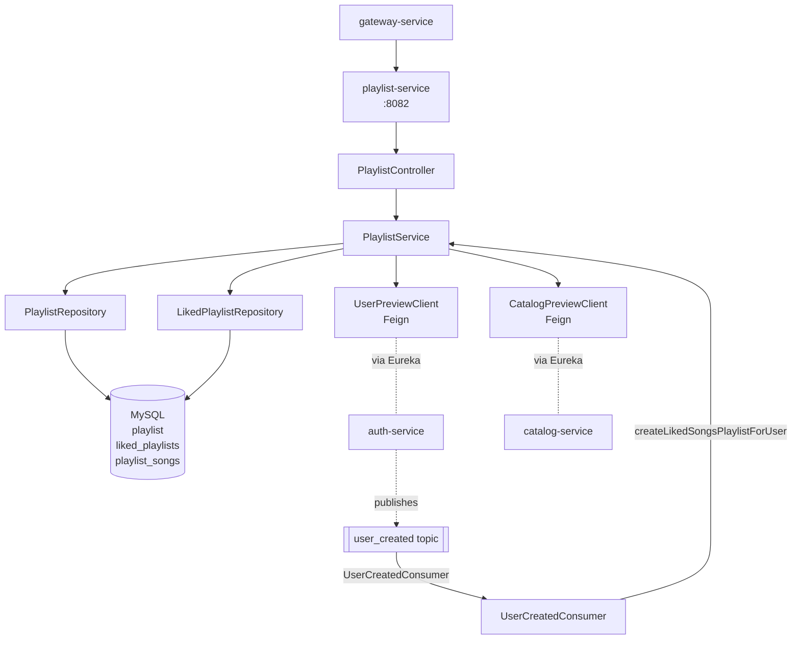
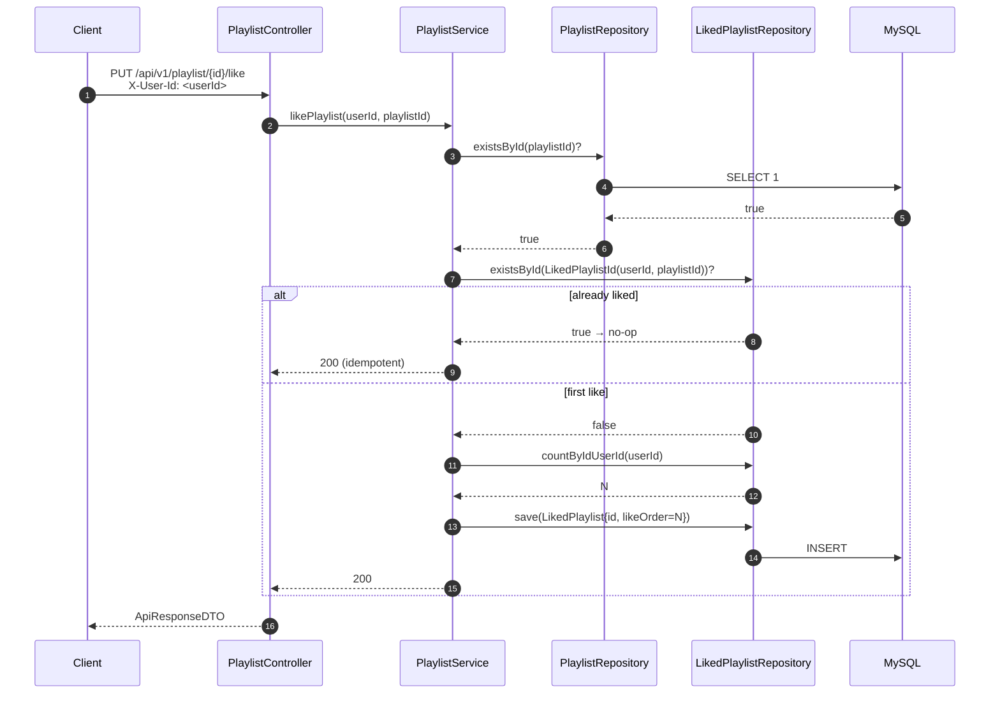
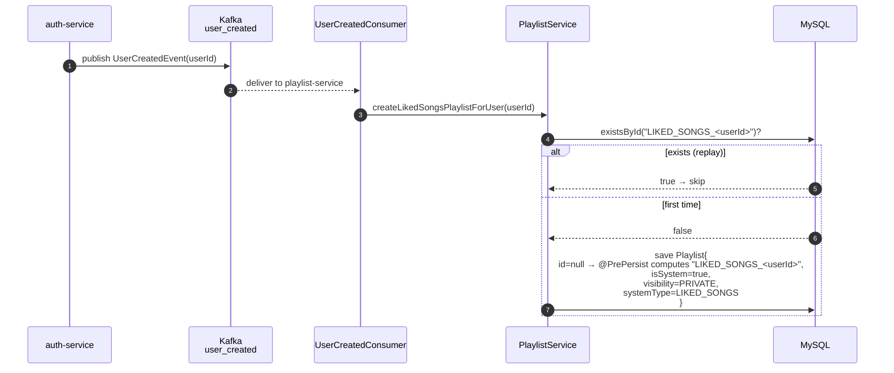
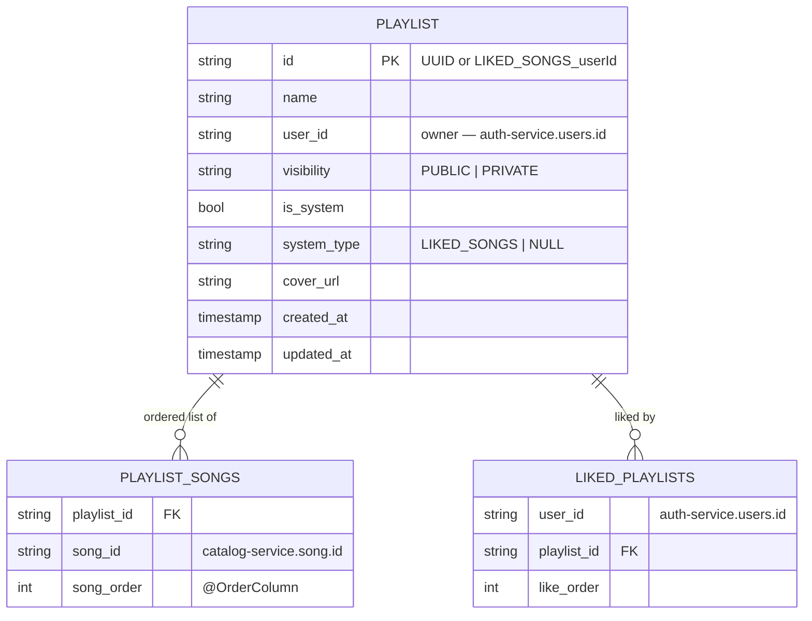

# playlist-service

Owns user playlists. Standard CRUD plus the special "Liked Songs" system playlist (auto-provisioned for every new user via Kafka). Tracks which playlists a user likes, in the order they liked them. Doesn't store songs itself — references them by `songId` and asks catalog-service for previews via Feign.

## Responsibilities

- CRUD for user-created playlists (visibility: PUBLIC / PRIVATE)
- Add / remove songs from a playlist (preserving insertion order via `@OrderColumn`)
- Like / unlike playlists; preserve the order in which a user liked them
- Auto-create a `LIKED_SONGS` system playlist for each new user (consumed from `user_created` event)
- Search playlists by name (PUBLIC only)
- Resolve song details + owner previews via Feign clients to catalog-service and auth-service

## Architecture



## Like Flow (composite-key tracking)



`LikedPlaylistId` is an `@EmbeddedId` with `(userId, playlistId)`. `likeOrder` increments per user, so a user's liked playlists can be returned in the order they were liked — not just by playlist creation time.

## System Playlist Provisioning



The `@PrePersist` hook on `Playlist` computes a deterministic ID (`SYSTEMTYPE_<userId>`) for system playlists, so consumer replays are naturally idempotent and you can find a user's Liked-Songs playlist without a separate index lookup.

## REST API

All routes under `/api/v1/playlist` and reachable through the gateway. Every authenticated route reads `X-User-Id` from the gateway-injected header.

| Method | Path | Auth | Purpose |
|---|---|---|---|
| GET | `/all` | user | Current user's non-system playlists, newest first |
| GET | `/{playlistId}` | user | Single playlist (rejects PRIVATE for non-owners) |
| GET | `/{playlistId}/songs` | user | Resolved song list via catalog-service |
| POST | `/upsert` | user | Create new or update existing (rejects edits to system playlists) |
| PUT | `/{playlistId}/song/{songId}` | user | Append song (deduped, ordered) |
| DELETE | `/{playlistId}/song/{songId}` | user | Remove song from playlist |
| PUT | `/{playlistId}/like` | user | Like (idempotent, increments per-user `likeOrder`) |
| DELETE | `/{playlistId}` | user | Delete (rejects system playlists with 400) |

### Search

| Method | Path | Purpose |
|---|---|---|
| GET | `/api/v1/playlist/search?key=&page=&size=` | Paginated case-insensitive search of PUBLIC playlists by name |

## Persistence Model



Three things worth noting about the data model:

- `playlist_songs` is a `@ElementCollection` with `@OrderColumn` — Hibernate maintains insertion order automatically, no explicit "position" field to update.
- `liked_playlists` uses an `@EmbeddedId` composite key `(user_id, playlist_id)` so Spring Data finder methods (`findByIdUserIdOrderByLikeOrderAsc`) work cleanly.
- `playlist.id` is computed in `@PrePersist`: for system playlists, `<systemType>_<userId>` (deterministic); otherwise `UUID.randomUUID().toString()`.

## Eventing

| Direction | Topic | Event | Group ID |
|---|---|---|---|
| Consumes | `user_created` | `UserCreatedEvent { userId }` | `playlist-service` |

Consumer auto-startup is enabled in production; tests disable it via `spring.kafka.listener.auto-startup=false` so they don't try to bind to a non-running broker.

## Cross-Cutting Concerns

- **Outbound Feign calls** (`UserPreviewClient` → auth-service, `CatalogPreviewClient` → catalog-service) go through `FeignClientConfig.gatewaySecretInterceptor` which stamps `X-Gateway-Secret` on every request. Required for the destination's `InternalTrafficFilter` to accept the call.
- **Resilience4j circuit breakers** wrap both clients. `UserPreviewClientFallback` returns null (playlists render without owner avatar). `CatalogPreviewClientFallback` returns empty list — `getSongsFromPlaylist` returns nothing when catalog is down, and `addSongToPlaylist` rejects with "Song not found" rather than silently accepting unverifiable IDs.
- **`/actuator/refresh` rebinds `gateway.secret`** via `GatewaySecretProperties` for hot rotation without a restart.

## Configuration

Local `application.properties`:

```properties
spring.application.name=playlist-service
server.port=8082
spring.config.import=optional:file:../env.properties,optional:configserver:http://localhost:8888
```

From `centralconfigs/playlist-service/playlist-service.properties`:

- `spring.datasource.*` — MySQL
- `spring.jpa.hibernate.ddl-auto=update`
- `spring.kafka.consumer.group-id=playlist-service`
- `spring.kafka.consumer.value-deserializer=...JsonDeserializer`
- `spring.kafka.consumer.properties.spring.json.trusted.packages=*`
- `spring.kafka.consumer.properties.spring.json.value.default.type=com.cadence.playlist_service.events.UserCreatedEvent`

## Testing

| Test | What it covers |
|---|---|
| `PlaylistServiceTest` | Service logic with mocked repositories + Feign clients |
| `PlaylistControllerTest` | `@WebMvcTest` slice — HTTP wiring + validation |
| `InternalTrafficFilterTest` | Gateway-secret enforcement |
| `PlaylistServiceIT` | Real MySQL — covers `@ElementCollection` + `@OrderColumn` ordering, `@EmbeddedId` like tracking, `@PrePersist` deterministic ID, search visibility filter, system-playlist deletion guard |

A real bug surfaced during IT writeup: `addSongToPlaylist` originally relied on OSIV (open-session-in-view) to lazy-load `playlist.songIds` outside a transaction. Fixed by adding `@Transactional` to the service method — both `addSongToPlaylist` and `removeSongFromPlaylist`.

```bash
cd playlist-service && ./mvnw test
```

## Local Development

```bash
cd playlist-service
./mvnw spring-boot:run
```

Required env:

- `DATASOURCE_*`
- `KAFKA_URL` — required even if you don't care about user-created consumer; the listener will retry-loop forever otherwise

## Boot Order

discovery-service → config-server → playlist-service. Feign clients to auth-service / catalog-service tolerate those services being absent (they fail per-call), but the `user_created` consumer will sit idle until auth-service publishes events.
