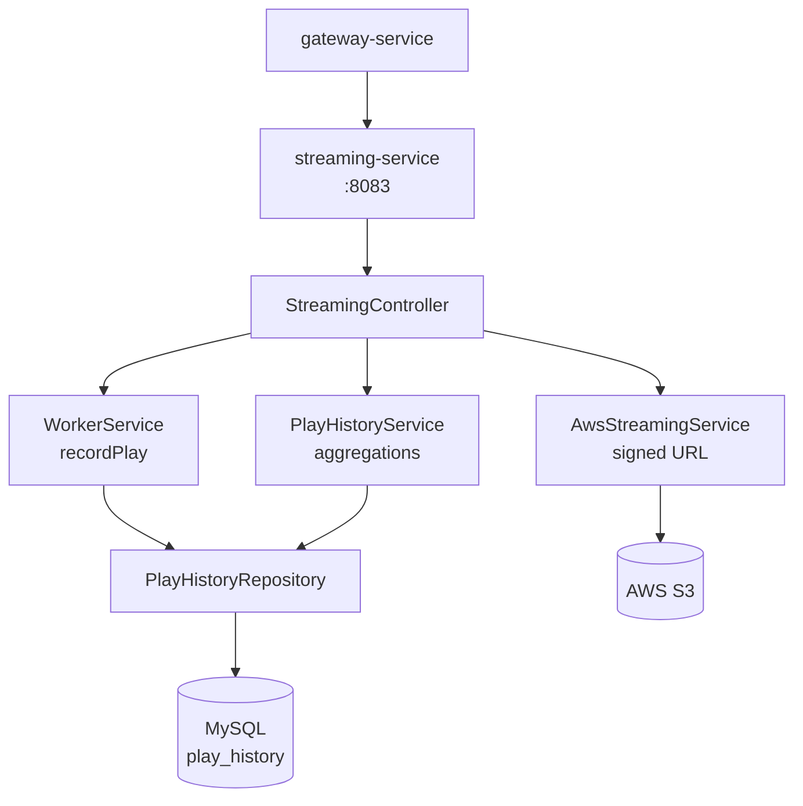
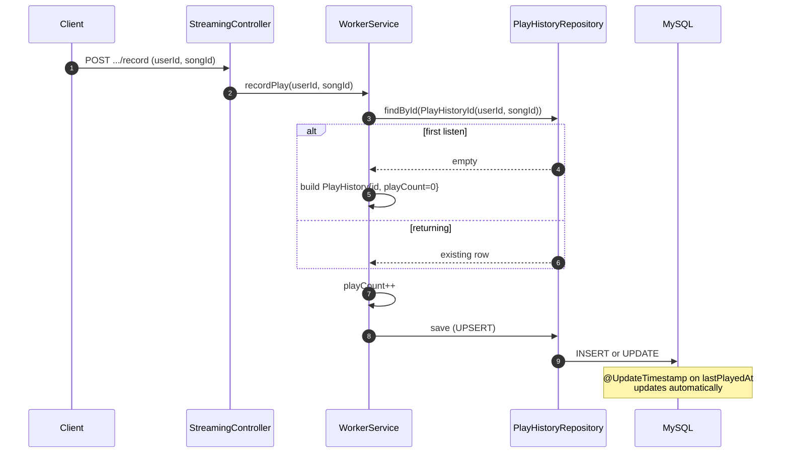
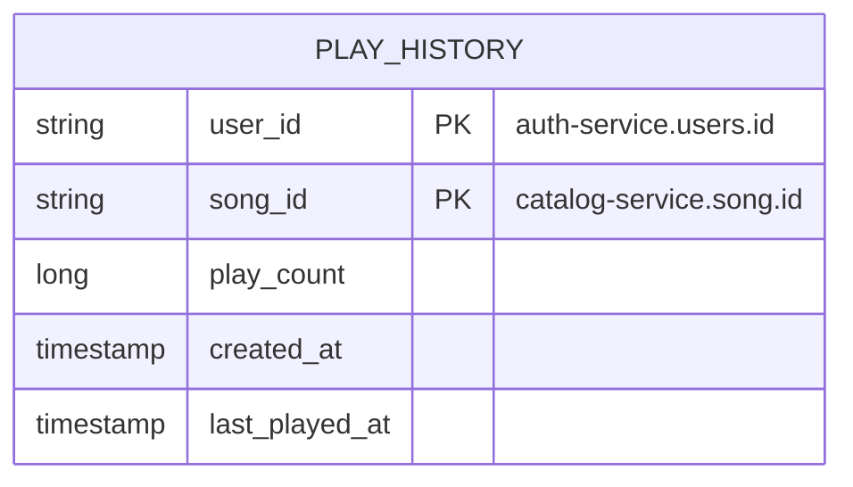

# streaming-service

Aggregates play history. Records what the user has been playing, exposes per-user history + top songs, and computes platform-wide stats (trending songs, total plays, unique listeners). Also serves the audio stream itself (S3 signed URLs).

## Responsibilities

- Record a play (called by the audio player after a song crosses the play threshold)
- Per-user reads: recent listening history, top songs by play count
- Platform reads: trending songs (windowed or all-time), total plays per song, unique-listener counts
- Audio streaming endpoint that returns an S3 signed URL for the requested song

## Architecture



`WorkerService.recordPlay` is the only write path; everything else is read-side aggregation.

## Recording a Play



Find-or-create + increment is intentionally simple — there's one row per `(user, song)` and `playCount` is the source of truth. Trending and stats queries derive from this.

## Read-Side Aggregations

`PlayHistoryService` is mostly thin wrappers around JPQL projection queries:

| Method | Backing query | Notes |
|---|---|---|
| `getRecentHistory` | `WHERE user_id = ? ORDER BY last_played_at DESC` | Per-user recency |
| `getUserTopSongs` | `WHERE user_id = ? ORDER BY play_count DESC` | Per-user top |
| `getTrendingSongs` | `SELECT song_id, SUM(play_count) GROUP BY song_id ORDER BY SUM DESC` | Platform-wide |
| `getTrendingSongsSince(Instant)` | Same + `WHERE last_played_at >= ?` | Time-windowed |
| `getSongStats(songId)` | `SUM(play_count)` + `COUNT(DISTINCT user_id)` | Total plays + unique listeners |
| `getSongPlayCounts(List<songId>)` | Aggregate over a song list | Bulk |
| `getUniqueListeners(List<songId>, Instant)` | `COUNT(DISTINCT user_id)` with optional time floor | |

The `SongPlayCountProjection` interface is a Spring Data interface projection (just `getSongId()` / `getPlayCount()`) — no DTO mapping in service code.

## REST API

All routes under `/api/v1/stream` and reachable through the gateway.

| Method | Path | Auth | Purpose |
|---|---|---|---|
| GET | `/song/{songId}` | user | Returns S3 signed URL for the song's audio file |
| GET | `/history` | user | Recent play history for `X-User-Id` |
| GET | `/stats/users/me/top-songs` | user | Top songs for `X-User-Id` |
| GET | `/stats/trending?since=&page=&size=` | public | Platform-wide trending; `since` filters by Instant |
| GET | `/stats/songs/{songId}` | public | `{ totalPlays, totalListeners }` |
| GET | `/stats/songs/play-counts?songIds=...` | public | Play counts for a list of songs (bulk) |
| GET | `/stats/listeners?songIds=...&since=` | public | Unique listener count across a song list |

## Persistence Model



Single table, composite `@EmbeddedId` of `(user_id, song_id)`. Indexes:

- `(user_id, song_id)` — primary lookup for `recordPlay`
- `(song_id)` — reverse lookup for per-song stats
- `(user_id, play_count DESC)` — for `getUserTopSongs`
- `(user_id, last_played_at DESC)` — for `getRecentHistory`
- `(song_id, last_played_at)` — for time-windowed trending

`@CreationTimestamp` and `@UpdateTimestamp` keep the audit fields in sync without explicit setters.

## Eventing

This service does not produce or consume Kafka events. Plays are recorded synchronously via HTTP — there's no benefit to going async because the call is on the critical path of the audio player anyway.

## Configuration

Local `application.properties`:

```properties
spring.application.name=streaming-service
server.port=8083
spring.config.import=optional:file:../env.properties,optional:configserver:http://localhost:8888
```

From `centralconfigs/streaming-service/streaming-service.properties`:

- `spring.datasource.*` — MySQL
- `spring.jpa.hibernate.ddl-auto=update`
- `cloud.aws.credentials.*`, `cloud.aws.region.static`, `cloud.aws.s3.bucket` — for signed URL generation

## Testing

| Test | What it covers |
|---|---|
| `WorkerServiceTest` | Find-or-create + increment with mocked repository |
| `PlayHistoryServiceTest` | Aggregation methods over mocked repository projections |
| `StreamingControllerTest` | `@WebMvcTest` slice — HTTP wiring + header validation |
| `InternalTrafficFilterTest` | Gateway-secret enforcement |
| `PlayHistoryIT` | Real MySQL — covers `@EmbeddedId` upsert, `lastPlayedAt` auto-update, JPQL aggregations (`SUM`/`GROUP BY`/`COUNT(DISTINCT)`), time-windowed filters with real `Instant` boundaries |

The integration tests use a real MySQL container so the `SUM`/`GROUP BY`/`COUNT(DISTINCT)` JPQL queries get exercised against a real query planner — mocks would never have caught a JPQL syntax mistake.

```bash
cd streaming-service && ./mvnw test
```

## Local Development

```bash
cd streaming-service
./mvnw spring-boot:run
```

Required env:

- `DATASOURCE_*`
- `AWS_*` if you want `/song/{songId}` signed URLs to work

## Boot Order

discovery-service → config-server → streaming-service. Independent of every other backend service at startup; the only cross-service references are by ID (no Feign calls).
